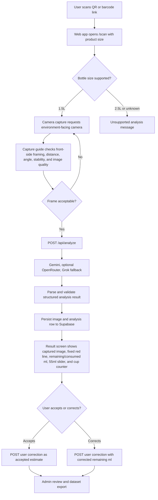

# Afia AI Project Brief

## Purpose

This document is the high-density project brief for AI agents and future maintainers working on `afia-app-simplified`. It explains what the project is, what is currently true, how the codebase is organized, which contracts matter, and which assumptions are unsafe.

Use this brief before making implementation, planning, QA, deployment, or documentation changes. For exact acceptance criteria, also read the active specs under `.kiro/specs`.

## Project Identity

| Field | Value |
| --- | --- |
| Project | Afia Oil Level Scanner |
| Repository | `afia-app-simplified` |
| Current product phase | Stage 1 validation, API-first |
| Primary supported product | Afia 1.5L cooking oil bottle |
| Unsupported product path | 2.5L identity can be shown, but analysis is blocked |
| Deployment target | Cloudflare Workers with static web assets |
| Persistence target | Supabase PostgreSQL and Storage |
| Primary model path | Gemini vision analysis with key rotation |
| Secondary model path | Explicitly configured OpenRouter image-capable models |
| Fallback model path | Grok vision fallback |
| Local/CV/ONNX status | Diagnostic and future-model work only |
| Canonical docs home | `.kiro/specs` |

## One-Sentence Summary

Afia is a Cloudflare-deployed phone web app that lets a consumer open a product scan link, capture a front-side image of a 1.5L Afia oil bottle, receive an API-first oil-level estimate, correct the result if needed, and feed reviewed records into a future local-model training dataset.

## Current Reality

The product has functional Stage 1 surfaces for scan, capture, result review, admin review, provider orchestration, Supabase persistence, and diagnostic CV/ONNX experiments. The important caveat is that the Stage 1.5 sign-off remains an accuracy NO-GO. Working screens and passing local tests do not mean the oil-level estimate is ready for production trust.

The latest documented live evidence says the deployed Worker crossed health, prompt-loading, and Gemini-provider execution boundaries, but Supabase persistence failed with an image-upload signature verification error. Treat deployed persistence and real phone-to-admin proof as active gates before claiming demo readiness.

## Non-Negotiable Boundaries

- Only 1.5L analysis is supported in Stage 1.
- 2.5L may be identified and messaged, but should not be analyzed.
- Stage 1 is API-first. Do not promote local inference, CV, or ONNX to primary production behavior without the dataset and accuracy gates defined in `.kiro/specs`.
- Supabase persistence is a product gate. A model result without a saved analysis record is not dataset-ready.
- User corrections and admin corrections are review evidence. They are not automatic ground truth unless review status and label-source rules mark them trusted.
- The measurement step is 55ml, equal to one quarter cup, unless a future spec deliberately changes it.
- Secrets must never be printed in prompts, logs, commits, docs, or summaries.
- Planning and durable project reference content belongs in `.kiro/specs`; do not recreate competing `.planning` or `docs` strategy trees.

## User Workflow



## Repository Map

```text
afia-app-simplified/
  .kiro/specs/
    afia-project-reference/       Canonical project context, technical reference, and this AI brief
    afia-remaining-milestones/    Active continuation plan and gap review
    afia-roadmap/                 Roadmap and stage framing
    stage1-llm-api-only/          Stage 1 API-first requirements and design
    stage2-local-model/           Stage 2 local-model requirements
  packages/shared/
    src/bottle.ts                 Bottle constants and supported sizes
    src/product-link.ts           Product scan link helpers
    src/schemas.ts                Shared contracts, warning/status enums, validators
  web/
    src/App.tsx                   SPA route map
    src/components/MockQrPage.tsx Mock QR/product identity surface
    src/components/ScanShell.tsx  Scan route and product-size handling
    src/components/CaptureShell.tsx Camera capture and image-quality flow
    src/components/ResultShell.tsx Result review and user correction flow
    src/components/AdminShell.tsx Admin review, correction, upload, export flow
  worker/
    src/index.ts                  Hono route registration and SPA fallback
    src/routes/analyze.ts         Primary API-first analysis route
    src/routes/correction.ts      User correction route
    src/routes/admin.ts           Admin list, patch, upload, and dataset export
    src/llm/                      Gemini, OpenRouter, Grok, key rotation, validation
    src/prompt/                   Versioned prompt bundle and bundled Worker fallback
    src/storage/supabase.ts       Supabase persistence adapter
    src/cv/                       Local diagnostic CV pipeline
    src/onnx/                     Local/future-model ONNX diagnostics
    src/eval/                     Evaluation, sign-off, manifest, and overlay tooling
  scripts/                        Operational scripts
  runs/                           Local generated eval outputs; mostly ignored
```

## Runtime Architecture

The Worker is the API and static asset entry point. `worker/src/index.ts` registers:

| Route | Purpose | Current meaning |
| --- | --- | --- |
| `GET /api/health` | Liveness check | Required live smoke route |
| `POST /api/analyze` | Primary analysis | Stage 1 API-first bottle analysis |
| `POST /api/analyses/:id/user-correction` | Consumer correction | Persists accepted estimate or corrected remaining ml |
| `GET /api/admin/analyses` | Admin list | Requires `ADMIN_TOKEN` bearer auth |
| `PATCH /api/admin/analyses/:id` | Admin correction | Requires `ADMIN_TOKEN` bearer auth |
| `POST /api/admin/upload` | Manual ground-truth upload | Requires `ADMIN_TOKEN` bearer auth |
| `GET /api/admin/dataset/export` | Dataset export | Exports trusted labels unless diagnostics are requested |
| `POST /api/cv-analyze` | CV diagnostic route | Disabled in deployed Stage 1 Worker with `501` |
| `GET /api/onnx-probe` | ONNX diagnostic route | Disabled in deployed Stage 1 Worker with `501` |

The React SPA uses:

| Route | Surface |
| --- | --- |
| `/` | Redirects to `/scan?size=1.5L` |
| `/mock-qr` | Mock product QR cards |
| `/scan` | Camera scan/capture flow |
| `/result` | Result review and correction flow |
| `/admin` | Admin review, correction, manual upload, and export flow |

## Analysis Contract

`POST /api/analyze` accepts an `AnalysisRequest`:

```ts
{
  bottleSize: "1.5L",
  imageBase64: string
}
```

The route rejects unsupported bottle sizes with `422`. It requires at least one configured provider key across Gemini, explicitly configured image-capable OpenRouter models, or Grok.

Provider order:

1. Gemini key pool, model default `gemini-2.5-flash`.
2. OpenRouter key pool only when `OPENROUTER_MODEL_ID` or `OPENROUTER_MODEL_IDS` contains model IDs recognized as image-capable by local allow-list logic.
3. Grok key pool, model default `grok-2-vision-1212`.

Fallback behavior:

- Gemini retries across its configured key pool.
- Low Gemini confidence can fall through to OpenRouter or Grok.
- OpenRouter retries across configured image-capable model IDs and key pool.
- Low OpenRouter confidence can fall through to Grok when Grok keys exist.
- Provider errors are redacted before public response/log details.

The successful response includes:

```ts
{
  remainingMl: number,
  consumedMl: number,
  redLineYRatio: number,
  confidence: number,
  warnings: string[],
  provider: "gemini" | "openrouter" | "grok",
  rawMetadata: {
    promptVersion: string,
    promptHash?: string,
    fewshotHash?: string,
    modelId: string,
    fallbackReason?: string,
    rawModelText?: string
  },
  analysisId: string
}
```

If Supabase persistence fails, the route returns `500` with a persistence error. Do not treat the analysis as dataset-ready.

## Data And Label Contract

Every durable analysis record should preserve:

- Image URL or storage key.
- Product size.
- Original model estimate.
- Remaining ml and consumed ml.
- Red-line Y ratio.
- Confidence.
- Warnings and quality tags.
- Provider and model metadata.
- Prompt version and prompt/few-shot hashes where available.
- Raw model text for auditability.
- User correction.
- Admin correction.
- Manual ground truth.
- Final accepted label.
- Label source.
- Correction status.
- Admin flag and note.

Correction statuses:

| Status | Meaning |
| --- | --- |
| `pending_review` | Needs review before trusted dataset use |
| `approved` | Estimate is accepted as usable |
| `rejected` | Excluded from trusted dataset |
| `manual_corrected` | Admin/manual correction supplies the trusted label |

Dataset export behavior:

- By default, export rows include only trusted labels.
- `includeDiagnostics=true` can include diagnostic rows.
- Rows with unsupported product, rejected status, untrusted quality tags, pending review, or missing final label are diagnostic-only.
- Trusted labels may come from approved model prediction, user accepted estimate, user submitted correction, admin correction, or manual ground truth, depending on record state.

## Quality Warnings

Known warning/tag values include:

- `blur`
- `glare`
- `mild_glare`
- `poor_lighting`
- `wrong_side`
- `partial_bottle`
- `poor_framing`
- `unknown_product`
- `unsupported_product`
- `uncertain_label`
- `low_confidence`

Warnings are not cosmetic. They influence review state, dataset inclusion, and future model-quality analysis.

## CV, Geometry, And ONNX Work

The repo contains active diagnostic and research code for:

- Candidate liquid-line detection.
- Bottle contour and geometry handling.
- Labeled mask helpers.
- Fill estimation and 1.5L calibration.
- CV pipeline confidence and fusion scoring.
- Overlay validation and overlay harnesses.
- ONNX feasibility and segmentation prototype work.

Current policy:

- These paths support evaluation, debugging, and future model design.
- Deployed Stage 1 Worker routes for CV/ONNX intentionally return `501`.
- Do not claim CV/ONNX production support unless a future milestone updates the runtime, size, memory, parity, and accuracy evidence.
- The stronger next technical direction is geometry-first hybrid analysis: local/CV proposes evidence, while the LLM validates or explains it.

## Evaluation And Sign-Off

Primary local commands:

```powershell
pnpm.cmd test
pnpm.cmd --filter @afia/shared test
pnpm.cmd --filter web test
pnpm.cmd --filter worker test
pnpm.cmd --filter web build
pnpm.cmd --filter worker build
pnpm.cmd --filter worker eval:dev-quick
pnpm.cmd --filter worker eval:cv
pnpm.cmd --filter worker eval:stage1-sample
pnpm.cmd --filter worker gate:rss
pnpm.cmd --filter worker signoff:stage15
```

Interpretation rules:

- Passing unit/component/build tests means the implementation is locally healthy.
- Stage 1.5 sign-off is the accuracy gate and is currently documented as NO-GO.
- Gemini-backed evals are rate-limit sensitive; preserve the 13-second inter-call delay in API-backed eval workflows.
- Browser-visible or phone-visible validation is required for camera/result/admin UX claims.
- Live `/api/health` is necessary but insufficient; also verify real `/scan`, `/api/analyze`, Supabase persistence, `/result`, `/admin`, and dataset export behavior before claiming deployed readiness.

## Deployment And Secrets

Use explicit Windows-safe deployment commands:

```powershell
pnpm.cmd --filter web build
pnpm.cmd --filter worker build
npm.cmd exec --yes --package wrangler@latest -- wrangler deploy --config worker\wrangler.jsonc
```

Expected secret/config areas:

- `GEMINI_API_KEY` and optional numbered Gemini keys.
- `OPENROUTER_API_KEY` and explicit image-capable `OPENROUTER_MODEL_ID` or `OPENROUTER_MODEL_IDS`.
- `GROK_API_KEY`.
- `GROK_FALLBACK_CONFIDENCE` when overriding the default confidence threshold.
- `ADMIN_TOKEN`.
- `SUPABASE_URL`.
- `SUPABASE_SERVICE_ROLE_KEY`.

Never expose secret values. Confirm the target Cloudflare Worker and Supabase project before rotating or uploading secrets.

## Documentation Sources Of Truth

Read in this order:

1. `README.md` for setup, commands, and a quick map.
2. `.kiro/specs/afia-project-reference/ai-project-brief.md` for AI-agent orientation.
3. `.kiro/specs/afia-project-reference/project-context.md` for product boundaries and active workflow.
4. `.kiro/specs/afia-project-reference/technical-reference.md` for architecture, route, eval, deployment, and research notes.
5. `.kiro/specs/afia-remaining-milestones/current-state-and-gap-review.md` for current gaps and evidence.
6. `.kiro/specs/afia-remaining-milestones/remaining-milestones-plan.md` for active continuation sequencing.
7. `.kiro/specs/afia-roadmap/overview.md` for stage-level roadmap.
8. `.kiro/specs/stage1-llm-api-only/requirements.md` and `design.md` for Stage 1 API-first detail.
9. `.kiro/specs/stage2-local-model/requirements.md` before any local-model promotion work.

## Safe Agent Behavior

When changing code:

- Inspect current repo state first; the worktree may be dirty.
- Preserve unrelated user changes.
- Keep changes scoped to Worker, Web, Shared, or docs ownership boundaries.
- Use shared schemas instead of inventing duplicate request/response shapes.
- Treat `.kiro/specs` as canonical for durable planning updates.
- For UI changes, validate in the browser when the route can be run locally.
- For deploy claims, distinguish local green from live verified.

When changing model or CV behavior:

- Keep provider metadata, prompt metadata, and fallback metadata in results.
- Keep 55ml measurement alignment across UI, schemas, tests, and dataset export.
- Fail closed on unsupported product, invalid input, missing provider keys, invalid admin auth, and persistence failures.
- Do not silently average conflicting model/CV results into a trusted answer.
- Queue uncertain or low-quality records for review instead of treating them as training labels.

When changing docs:

- Update this brief if the high-level architecture, supported product scope, provider order, data contract, stage status, or verification gates change.
- Update `project-context.md` when product boundaries or stage truth changes.
- Update `technical-reference.md` when implementation, commands, routes, deployment, or research conclusions change.
- Update the remaining milestones packet when evidence changes the active plan.

## Current Open Risks

- Stage 1.5 accuracy remains NO-GO.
- Deployed Supabase persistence needs renewed proof after the documented signature verification failure.
- CV/ONNX diagnostics are not production runtime surfaces.
- 2.5L support is identity-only.
- API-only vision may remain insufficient without geometry-first candidate evidence and better reviewed data.
- Dataset trust depends on correction status, quality tags, and label-source separation.

## Compact Context For LLMs

Afia is a pnpm TypeScript monorepo with a Cloudflare Worker, React/Vite SPA, and shared schema package. The current product is a Stage 1 API-first scanner for Afia 1.5L oil bottles. The user opens `/scan?size=1.5L`, captures a front-side bottle photo, sends it to `POST /api/analyze`, receives a Gemini/OpenRouter/Grok analysis, persists it to Supabase, reviews it on `/result`, and can submit a 55ml-step correction. Admin users review records on `/admin`, patch correction state, upload manual labels, and export trusted dataset rows. CV/ONNX/local-model code exists for diagnostics and future Stage 2 work but is not production primary; deployed CV/ONNX routes intentionally return `501`. The biggest current caveat is accuracy: Stage 1.5 sign-off is documented as NO-GO, and live deployed persistence still needs proof after a Supabase image-upload signature issue. Future work should preserve secrets, fail closed, maintain provider/prompt/provenance metadata, keep `.kiro/specs` as canonical docs, and distinguish local green tests from live phone-to-admin validation.
