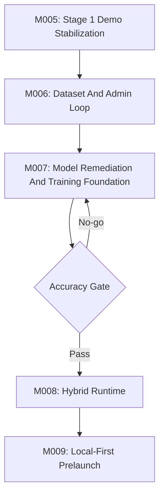

# Afia Remaining Milestones Plan

Updated: 2026-05-19

## Planning Position

GSD M001-M004 have produced useful infrastructure and evidence, but they did not finish the product. The key result is:

- The mobile scan/capture/result/admin shell mostly exists.
- API analysis and persistence exist.
- CV/ONNX/fusion diagnostics exist.
- Accuracy is still a NO-GO.
- Admin/dataset validation is still open.

Therefore the remaining plan should not restart the project. It should stabilize the working product loop, validate the data loop, then use that data to earn a better model.

## Stage Strategy

## Milestone Map

| Milestone | Phase | Primary question | Exit gate |
| --- | --- | --- | --- |
| M005 | Stage 1 demo stabilization | Can the existing QR -> capture -> API -> result -> Supabase -> admin loop run on a real phone against the current Worker? | One verified 1.5L live phone run with persisted admin-reviewable record. |
| M006 | Stage 1 data loop | Can corrections and manual uploads produce a trusted training dataset? | Admin-reviewed dataset v0 with clean labels, quality tags, and export/query path. |
| M007 | Stage 2 model foundation | Can a retrained or redesigned local/CV model beat the current NO-GO metrics? | Repeated eval proves target accuracy or records a formal no-go with next remediation. |
| M008 | Stage 2 hybrid runtime | Can the local model become the primary supported path with Gemini/Grok fallback? | Common valid 1.5L captures complete through local primary with explainable fallback. |
| M009 | Stage 3 prelaunch | Can the product run local-first/local-only with reliable UX, monitoring, and privacy decisions? | Launch-candidate report passes accuracy, device, monitoring, rollback, and privacy gates. |

## Non-Negotiable Rules

- Keep 1.5L as the only supported analysis product until the full loop is stable.
- Keep 2.5L as product identity/QR readiness only.
- Use 55ml as the primary exact tolerance and slider/cup step.
- Never claim accuracy from working screens alone.
- Keep secrets out of docs, prompts, logs, and summaries.
- Use `pnpm.cmd` on this Windows host.
- Test each step before starting the next step.
- Prefer real phone/browser-visible verification for scan/capture UX.
- Prefer live endpoint verification for Cloudflare/Supabase runtime claims.

## Planning Documents In This Set

| File | Purpose |
| --- | --- |
| `current-state-and-gap-review.md` | Evidence-based comparison between achieved GSD work and the requested workflow. |
| `m005-stage1-demo-stabilization.md` | Remaining Stage 1 demo and state-reconciliation milestone. |
| `m006-stage1-dataset-admin-loop.md` | Admin correction, manual upload, quality tagging, and dataset readiness milestone. |
| `m007-stage2-model-foundation.md` | Local/CV model remediation, training, and sign-off milestone. |
| `m008-stage2-hybrid-runtime.md` | Local-primary plus API-fallback runtime milestone. |
| `m009-stage3-local-first-prelaunch.md` | Local-first/local-only launch-candidate milestone. |

## Recommended Next Action

Start M005 before adding more model work. The current product needs a trustworthy live demo baseline and state cleanup first; otherwise the next model iteration will be disconnected from the actual user/admin flow.

Implementation order for the next context:

1. Run a quick repo and runtime preflight.
2. Execute M005 slice by slice.
3. Verify browser/mobile behavior before Worker deployment.
4. Verify Worker/Supabase live behavior before marking M005 complete.
5. Only then move to M006 dataset labeling and admin-loop hardening.

## BMad/GSD Use

The best BMad flow from here is:

1. `[SP]` `bmad-sprint-planning` for M005.
2. `[CS]` `bmad-create-story` for the next slice.
3. `[DS]` `bmad-dev-story` for implementation.
4. `[CR]` `bmad-code-review` for defects and regression risk.
5. Repeat until the milestone exit gate is proven.

Use `[CC]` `bmad-correct-course` only if the team wants a formal change proposal that demotes the old "LLM-only accuracy" premise and elevates the evidence-backed hybrid strategy.

