# Afia Remaining Milestones Plan

Updated: 2026-05-19

## Planning Position

GSD M001-M004 have produced useful infrastructure and evidence, but they did not finish the product. The key result is:

- The mobile scan/capture/result/admin shell mostly exists.
- API analysis and persistence exist.
- CV/ONNX/fusion diagnostics exist.
- Accuracy is still a NO-GO.
- Admin/dataset validation is still open.
- The latest live S17 probe crossed the deployed Worker health, prompt-loading, and Gemini provider boundaries, but Supabase persistence is currently blocked by a deployed service-role secret mismatch.
- The deployed Worker intentionally keeps CV/ONNX diagnostics out of the public runtime while local eval/sign-off tooling remains available.
- The default Worker test suite is now reconciled with runtime intent: direct Gemini fetch is tested offline, CV/ONNX diagnostics are tested through local diagnostic apps, deployed diagnostic endpoints stay disabled with `501`, and admin routes fail closed without `ADMIN_TOKEN`.

Therefore the remaining plan should not restart the project. It should stabilize the working product loop, validate the data loop, then use that data to earn a better model.

## Party-Mode Review Result

Reviewed against the current code in `packages/shared`, `web`, and `worker` plus the latest S17 evidence. The remaining milestones stay in the right order, but their emphasis changes:

- M005 is still active and should be treated as blocked at S17, not complete. The local test/runtime reconciliation slice is complete; the blocker is now live Supabase persistence/admin/phone proof.
- M006 must validate the correction dataset contract before any new model training work. Existing admin surfaces are implemented, but they are not yet training-data proof.
- M007 should not be framed as "continue ONNX integration"; that implementation evidence already exists. It is now a model-remediation and dataset-driven candidate milestone after M006.
- M008 and M009 remain downstream gates only. They should not start while Stage 1.5 accuracy is NO-GO and the live product loop is not fully persisted/admin-reviewable.

Roundtable decision, 2026-05-19: the requested workflow is fully covered by the active milestone chain, but only as a gated plan. Product, UX, architecture, and quality review all agree that M005 remains the immediate boundary: close deployed Supabase persistence, prove a real phone-to-admin trace, then move to M006 dataset rules. Do not skip directly to local-model work.

## Implemented Review Fixes

| Issue / gap | Cause | Implemented fix | Remaining milestone impact |
| --- | --- | --- | --- |
| Full Worker suite was red | Unit tests still mocked the old Gemini SDK and route tests expected deployed CV/ONNX endpoints to be active. | Gemini tests now mock direct `fetch`; CV/ONNX behavior is split between local diagnostic-route tests and deployed `501` safety tests. | M005 S14 can be treated as completed locally. |
| Admin routes could fail open | `requireAdmin` returned success when `ADMIN_TOKEN` was absent. | Admin routes now return `401` when no admin token is configured. | M005/S17 must verify this behavior on the deployed Worker. |
| Low-confidence Gemini success did not use fallback | Fallback only happened after Gemini request failure. | `/api/analyze` now falls back to Grok when Gemini confidence is below the configured threshold and a Grok key exists. | M005/S17 should verify fallback metadata; M006 should preserve original/fallback provenance for dataset review. |
| Result slider correction was local-only | The UI let users correct the displayed value but did not submit that correction. | Result screen now exposes accept/submit correction when an `analysisId` exists; Worker persists it as pending admin review. | M005 must prove this live; M006 turns it into dataset policy. |
| Basic capture quality checks were missing from the user path | Quality taxonomy existed mainly in diagnostics. | Capture now rejects obviously low-resolution, too-dark/overexposed, and very blurry/flat frames when canvas data is available. | M006 should store quality tags and export filtering rules. |
| Bottle outline was static only | The guide did not react to distance, position, or phone angle. | Capture now samples the live video frame, estimates bottle silhouette alignment, gives closer/farther/angle guidance, turns red/orange/green, and auto-captures after a stable green lock. | M005 must prove the functional guide on a real phone and tune thresholds from field images. |
| Arabic/theme floating controls were mojibake | UI strings were stored with broken encoding. | Arabic i18n and floating control glyphs were corrected. | M005 phone smoke should include language/theme visual checks. |
| README deployment command was wrong | README referenced a missing `pnpm deploy` script. | README now uses the explicit Windows-safe Wrangler deploy command. | Reduces handoff risk before the next live deploy. |
| Historical stripped plan caused scope drift | The old stripped doc still described Stage 1 as eval-only. | The stripped plan now has a historical note pointing to the active roadmap and remaining-milestones packet. | Future planning should not reopen settled Stage 1 scope. |

## Stage Strategy

```mermaid
flowchart TD
  A["M005: Stage 1 Demo Stabilization"] --> B["M006: Dataset And Admin Loop"]
  B --> C["M007: Model Remediation And Training Foundation"]
  C --> D{"Accuracy Gate"}
  D -- "No-go" --> C
  D -- "Pass" --> E["M008: Hybrid Runtime"]
  E --> F["M009: Local-First Prelaunch"]
```

## Required Product Workflow

| Workflow step | Current implementation | Remaining milestone decision |
| --- | --- | --- |
| 1. Product barcode/mock QR identifies bottle size. | `/mock-qr` renders a scan link for 1.5L and keeps 2.5L as a mock identity card only. Shared code still knows 2.5L exists, but the visible flow no longer invites a 2.5L scan. | M005 only needs to prove the 1.5L mock QR scan path. Real packaging/barcode integration and 2.5L scan entry remain later handoffs once URLs and geometry are ready. |
| 2. Barcode opens the deployed Cloudflare web link and triggers camera access. | Cloudflare Worker serves the SPA; `/scan?size=1.5L` requests the environment camera. | M005 S17 must prove this on a real phone against the deployed Worker, not just jsdom. |
| 3. Front-side camera guidance and bottle outline. | Capture UI directs the user to photograph the front side, uses a transparent real-bottle outline, keeps the bottle smaller in frame, estimates live silhouette alignment, gives closer/farther/angle guidance, turns red/orange/green, and auto-captures after a stable green lock. Manual capture remains available as a fallback. | M005 must tune and prove this on real phone footage because browser-frame heuristics can vary by lighting/background. |
| 4. Basic quality detection. | Capture checks minimum resolution, very dark/overexposed frames, and very blurry/flat frames before analysis when browser canvas data is available. Shared warning taxonomy includes blur, glare, poor lighting, wrong side, partial bottle, poor framing, unsupported product, and uncertain label. Admin dataset export now keeps trusted labels separate from diagnostic records. | M006 must prove the export against deployed Supabase data and then refine reviewer rules; Stage 2 can make quality guidance live and visual. |
| 5. API-first analysis now, local model later. | `/api/analyze` uses Gemini key rotation, Grok fallback on provider failure or low confidence, Supabase image/row persistence, admin review, manual upload, and user correction submission. CV/ONNX/local diagnostics exist but are not production primary. | M005 proves live API/persistence/admin. M006 creates a trusted dataset. M007 trains/remediates local candidates. M008 promotes local browser/mobile model to primary only after accuracy gates pass, with LLM fallback retained. |
| 6. Result image, red line, slider, and cup counter. | Result screen shows the actual captured image, fixed detected red line, remaining/consumed text, a left 55ml-step slider starting at the detected estimate, and a quarter-cup counter. User corrections can be submitted for admin review when an `analysisId` exists. | M005 must verify the result on real phone/mobile browser. M006 must ensure submitted corrections become auditable dataset labels, not silent prediction changes. |

## Milestone Map

| Milestone | Phase | Primary question | Exit gate |
| --- | --- | --- | --- |
| M005 | Stage 1 demo stabilization | Can the existing QR -> capture -> API -> result -> Supabase -> admin loop run on a real phone against the current Worker? | One verified 1.5L live phone run with persisted admin-reviewable record after the Supabase service-role secret is refreshed. |
| M006 | Stage 1 data loop | Can corrections and manual uploads produce a trusted training dataset? | Admin-reviewed dataset v0 with clean labels, quality tags, correction provenance, and export/query path. |
| M007 | Stage 2 model foundation | Can a dataset-backed local/CV/model candidate beat the current NO-GO metrics? | Repeated eval proves target accuracy or records a formal no-go with next remediation. |
| M008 | Stage 2 hybrid runtime | Can the local model become the primary supported path with Gemini/Grok fallback? | Common valid 1.5L captures complete through local primary with explainable fallback. |
| M009 | Stage 3 prelaunch | Can the product run local-first/local-only with reliable UX, monitoring, and privacy decisions? | Launch-candidate report passes accuracy, device, monitoring, rollback, and privacy gates. |

## Non-Negotiable Rules

- Keep 1.5L as the only supported analysis product until the full loop is stable.
- Keep 2.5L as product identity/QR readiness only.
- Use 55ml as the primary exact tolerance and slider/cup step.
- Never claim accuracy from working screens alone.
- Keep secrets out of docs, prompts, logs, and summaries.
- Use `pnpm.cmd` on this Windows host.
- Test each step before starting the next step.
- Prefer real phone/browser-visible verification for scan/capture UX.
- Prefer live endpoint verification for Cloudflare/Supabase runtime claims.
- Keep manual capture as fallback while functional outline and auto-capture thresholds are tuned.
- Treat manual uploads, user corrections, and admin corrections as different label sources, never as interchangeable predictions.

## Planning Documents In This Set

| File | Purpose |
| --- | --- |
| `current-state-and-gap-review.md` | Evidence-based comparison between achieved GSD work and the requested workflow. |
| `m005-stage1-demo-stabilization.md` | Remaining Stage 1 demo and state-reconciliation milestone. |
| `m006-stage1-dataset-admin-loop.md` | Admin correction, manual upload, quality tagging, and dataset readiness milestone. |
| `m007-stage2-model-foundation.md` | Local/CV model remediation, training, and sign-off milestone. |
| `m008-stage2-hybrid-runtime.md` | Local-primary plus API-fallback runtime milestone. |
| `m009-stage3-local-first-prelaunch.md` | Local-first/local-only launch-candidate milestone. |

## Recommended Next Action

Live M005 S17 phone-to-admin proof is intentionally delayed for now. Continue local implementation that does not depend on live phone evidence, especially the M006 admin/dataset contract, while keeping Stage 2 model promotion blocked until deployed evidence exists.

Implementation order for the next context:

1. Keep 2.5L visible only as mock identity until the 1.5L loop is proven.
2. Implement local M006 dataset export/query rules behind admin auth.
3. Verify local route, UI, and build gates.
4. When live proof resumes, refresh the Supabase service-role secret without printing it, then run the deployed 1.5L phone-to-admin trace.
5. Only after that live proof, use exported trusted records as Stage 2 training inputs.

## BMad/GSD Use

The best BMad flow from here is:

1. `[SP]` `bmad-sprint-planning` for M005.
2. `[CS]` `bmad-create-story` for the next slice.
3. `[DS]` `bmad-dev-story` for implementation.
4. `[CR]` `bmad-code-review` for defects and regression risk.
5. Repeat until the milestone exit gate is proven.

Use `[CC]` `bmad-correct-course` only if the team wants a formal change proposal that demotes the old "LLM-only accuracy" premise and elevates the evidence-backed hybrid strategy.
