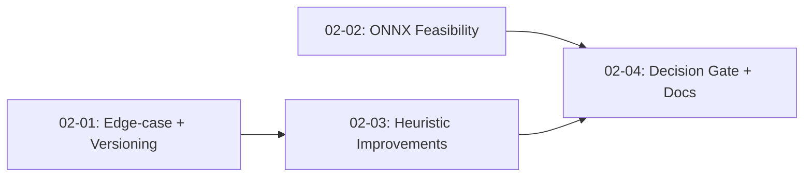

# Roadmap: v1.0 Production Readiness

**5 phases** | **23 requirements mapped** | All covered ✓

| # | Phase | Goal | Requirements | Success Criteria |
|---|-------|------|--------------|------------------|
| 1 | Staging Environment & Eval Harness | CI pipeline, staging Worker, eval scripts land first so accuracy work has guardrails | OPS-01, OPS-02, TEST-01, TEST-03, UX-01 | CI runs vitest + eval:dev on push; staging auto-deploys; fallback UX renders on failure |
| 2 | Heuristic Improvements & ONNX Feasibility | Improve contour scoring, prove ONNX on Workers, build edge-case eval corpus | ACCR-01, ACCR-02, ACCR-05, ACCR-06, TEST-02 | Heuristic confusion ≤1/10; tiny ONNX runs in Worker; 30 edge-case images collected & labelled |
| 3 | ONNX Integration & Accuracy Gate | Train regression model, integrate into pipeline, validate MAE/RMSE targets | ACCR-03, ACCR-04, ACCR-07, ACCR-08 | MAE < 45ml, RMSE < 70ml on sealed holdout for 3 consecutive runs |
| 4 | Observability & Infrastructure Hardening | Structured logging, Supabase security split, monitoring, secrets cleanup | OPS-04, OPS-05, OPS-06, OPS-08 | Typed events with trace IDs; anon/service_role Supabase split; no env key logging; alerts configured |
| 5 | Resilience & Production Launch | Provider circuit breaker, exhaustion tests, domain setup, sign-off gate, correction flow tests | OPS-03, OPS-07, TEST-04, TEST-05, UX-02 | Production Worker live at custom domain; circuit breaker auto-skips failing keys; launch gate signed off |

---

## Phase Details

### Phase 1: Staging Environment & Eval Harness

**Goal:** Establish staging Worker environment and automated CI pipeline before any accuracy tuning begins.

**Requirements:** OPS-01, OPS-02, TEST-01, TEST-03, UX-01

**Plans:** 4 plans in 3 waves

Plans:
- [x] 01-01-PLAN.md — CI/CD Pipeline & Eval Infrastructure (Wave 1, autonomous)
- [x] 01-02-PLAN.md — Fallback UX (Wave 1, has checkpoint)

**Success criteria:**
1. Staging Worker deploys with separate wrangler config (staging/production split)
2. CI pipeline runs `vitest run` + `eval:dev-quick` (10-fixture sample) on every push — feedback under 5min
3. Edge-case fixture eval script exists and runs in CI
4. Signoff gate (`pnpm signoff`) runs on PR merge
5. Fallback UX renders clear error message + retry button when inference fails

---

### Phase 2: Heuristic Improvements & ONNX Feasibility

**Goal:** Improve existing heuristic scoring to reduce confusion errors and prove ONNX deployment path on Workers.

**Requirements:** ACCR-01, ACCR-02, ACCR-05, ACCR-06, TEST-02

**Success criteria:**
1. Heuristic scoring produces ≤1 false full/empty classification per 10 holdout images
2. Tiny ONNX model (constant output) deploys and runs in Worker without runtime errors
3. ONNX memory/cold-start budget validated: model size, inference latency p95, peak RSS under load
4. Decision gate: if ONNX exceeds budget, fall back to heuristic + LLM
5. Edge-case image corpus (20-30 images) collected and labelled in `worker/test/fixtures/edge-case/`
6. Model version tracking scheme defined (ONNX hash + extractor version + prompt hash + eval summary)
7. ONNX model loading test passes in Workers runtime
8. Edge-case images available *before* heuristic tuning starts (ACCR-05 before ACCR-02)

**Plans:** 4 plans in 3 waves

**Plan structure:**

Plans:
- [x] 02-01-PLAN.md — Edge-case Corpus & Model Version Tracking (Wave 1, autonomous)
- [ ] 02-02-PLAN.md — ONNX Feasibility Spike (Wave 1, autonomous)
- [ ] 02-03-PLAN.md — Heuristic Improvements (Wave 2, autonomous)
- [ ] 02-04-PLAN.md — Decision Gate & Documentation (Wave 3, autonomous)

---

### Phase 3: ONNX Integration & Accuracy Gate

**Goal:** Train real regression model, integrate into CV pipeline, validate accuracy against targets.

**Requirements:** ACCR-03, ACCR-04, ACCR-07, ACCR-08

**Success criteria:**
1. Holdout set validated for diversity (lighting, phone cameras, bottle orientations, field conditions)
2. Regression model trained offline, exported to ONNX, integrated into pipeline at confidence scoring branch
3. ONNX integration test passes — pre-extracted features through ONNX runtime match expected outputs
4. MAE < 45ml and RMSE < 70ml on sealed holdout set for 3 consecutive runs
5. Provider type in schema updated to include `"cv" | "cv_llm"` for pipeline traceability

---

### Phase 4: Observability & Infrastructure Hardening

**Goal:** Production-ready logging, security hardening, and monitoring infrastructure.

**Requirements:** OPS-04, OPS-05, OPS-06, OPS-08

**Success criteria:**
1. Structured logger emits typed events (`event`, `traceId`, `duration`, `error`) for all pipeline stages
2. Supabase uses anon key on public routes with RLS; service_role key scoped to admin routes only
3. No API keys or env vars logged at startup (fix `worker/src/env.ts:30`)
4. Error monitoring alerts on: MAE regression, fallback rate > 5%, API p95 > 10s

---

### Phase 5: Resilience & Production Launch

**Goal:** Provider resilience, production domain, launch gate, automated rollout.

**Requirements:** OPS-03, OPS-07, TEST-04, TEST-05, UX-02

**Success criteria:**
1. Production Worker live at custom domain with valid SSL
2. Provider circuit breaker with KV-backed health status: auto-skips keys after 3 consecutive 429s, ordered fallback chain
3. Provider exhaustion integration test: all Gemini keys → Grok → Grok fails → 503 response
4. Admin correction flow test: validate corrected values handled correctly without re-evaluation
5. Launch sign-off gate documented with owner and criteria checklist

---

*Phase numbering started at Phase 1 (first milestone in new planning system)*
*Last updated: 2026-05-15 (restructured after agent review)*
