# Afia Oil Level Scanner — Comprehensive Documentation

## 1. Project Overview

**Afia Oil Level Scanner** is a Cloudflare-deployed web application that enables consumers to scan QR codes on Afia cooking oil bottles, capture photos, and receive LLM-analyzed oil level measurements. The project follows a two-stage approach.

### Two-Stage Strategy

| Stage | Focus | Status |
|-------|-------|--------|
| **Stage 1** | Research Spike: Validate Gemini ml-prediction accuracy against sealed ground-truth fixtures. No UI, no deployment, no persistence — just an eval runner CLI. Exit gate: ≥90% exact accuracy (±55ml), ≥80% per-stratum, byte-stable JSONL, human sign-off. | In Progress |
| **Stage 2** | Consumer App: React SPA, Cloudflare Worker HTTP API, Supabase persistence, admin review queue, multi-key Gemini rotation, Grok fallback, camera capture, result UI. | Deferred until Stage 1 passes |

### Kill Condition (Stage 1)

Stage 1 exits when **all** of:
1. **≥90% exact-bucket accuracy** (predicted ml within ±55ml of folder-name ground truth) on sealed 40-image holdout set
2. **≥80%** exact-bucket accuracy on **every individual stratum** (anti-gaming)
3. **Byte-stable JSONL** on ≥38/40 fixtures across 3 runs at `temperature=0`
4. **Versioned prompt + few-shots + comparator + fixture manifest** committed at a tagged SHA
5. **Domain reviewer sign-off** recorded in `runs/signoffs.jsonl`

---

## 2. Tech Stack

| Layer | Technology | Version |
|-------|-----------|---------|
| Runtime | Node.js | 18+ |
| Package Manager | pnpm | 9.12.3 |
| Language | TypeScript | 5.6.3 |
| Monorepo | pnpm workspaces | — |
| API Server | Hono (Cloudflare Workers) | 4.6.10 |
| Frontend | React | 18.3.1 |
| Frontend Build | Vite | 5.4.10 |
| Styling | Tailwind CSS | 3.4.14 |
| Routing (FE) | react-router-dom | 6.27.0 |
| LLM Client | @google/generative-ai | 0.21.0 |
| Database | @supabase/supabase-js | 2.49.4 |
| Computer Vision | @techstark/opencv-js | 4.12.0 |
| Image Decoding | jpeg-js, pngjs | — |
| Image Processing | sharp | 0.34.5 |
| Validation | zod | 3.23.8 |
| Testing | Vitest, Testing Library (React) | 2.1.4 |
| CLI Runner | tsx | 4.19.2 |
| Cloudflare | Wrangler (wrangler.jsonc) | — |

---

## 3. Directory Structure

```
afia-app-simplified/
├── .env                              # API keys (GEMINI, GROK, HF, OPENROUTER, SUPABASE)
├── .gitignore
├── package.json                      # Root monorepo package
├── pnpm-lock.yaml
├── pnpm-workspace.yaml               # Workspace: worker, web, packages/*
├── tsconfig.base.json                # Shared TS compiler options
├── README.md                         # Project overview
├── workflow.txt                      # User workflow specification
│
├── agent-os/                         # AI agent OS framework (separate sub-project)
│
├── docs/                             # Project documentation
│   ├── COMPREHENSIVE-DOCUMENTATION.md   # THIS FILE
│   ├── cv-pipeline-architecture.md      # CV pipeline design doc
│   ├── model-training-pipeline.md       # ML model training doc
│   ├── project-context.md               # Product context & roadmap
│   ├── engineering/
│   │   └── symphony-afia-setup.md       # Symphony agent harness
│   └── superpowers/plans/
│       ├── QUICK-START.md               # Stage 1 quick-start
│       ├── STAGE1-CHANGES.md            # Re-scoping to eval-only spike
│       ├── 2026-05-06-afia-stage1-simplified.md
│       ├── 2026-05-06-afia-stage1-llm-api-first.md
│       └── 2026-05-12-stage1-remediation-plan.md
│
├── oil-bottle-frames/               # Real video-frame images (28 ml-levels)
│   ├── 1.5L_refs/                    # Reference shots (1500ml, 750ml, 55ml, empty)
│   ├── 55ml/, 110ml/, ..., 1500ml/, empty/
│   └── SVG outline files
│
├── oil-bottle-augmented/            # AI-augmented bottle images (28 ml-levels)
│   ├── 55ml/, 110ml/, ..., 1500ml/, empty/
│
├── packages/
│   └── shared/                      # @afia/shared
│       ├── package.json
│       ├── tsconfig.json
│       └── src/
│           ├── index.ts             # Barrel exports
│           ├── bottle.ts            # Bottle constants & specs
│           ├── product-link.ts      # QR URL builders, SVG generator
│           ├── schemas.ts           # Runtime validation schemas
│           ├── types.ts             # TypeScript interfaces
│           ├── types.test.ts        # Tests
│           ├── product-link.test.ts
│           └── scan-schema.test.ts
│
├── runs/                            # Eval run output artifacts
│   ├── cv-eval-200/                 # CV pipeline eval JSON results
│   ├── cv-vs-gemini-comparison.md
│   └── signoffs.jsonl               # Reviewer sign-off records
│
├── scripts/
│   └── set-worker-secrets.ps1       # Upload secrets to Cloudflare
│
├── web/                             # React SPA (Vite + Tailwind)
│   ├── index.html
│   ├── package.json
│   ├── postcss.config.js
│   ├── tailwind.config.ts
│   ├── tsconfig.json
│   ├── vite.config.ts
│   ├── vitest.config.ts
│   ├── src/
│   │   ├── main.tsx                 # Entry point
│   │   ├── App.tsx                  # Routes
│   │   ├── index.css                # Tailwind directives
│   │   ├── i18n.tsx                 # English/Arabic i18n
│   │   ├── theme.tsx                # Light/dark theme
│   │   ├── errors.ts                # Error code definitions
│   │   └── components/
│   │       ├── FloatingControls.tsx  # Language/theme toggle
│   │       ├── MockQrPage.tsx        # Mock QR generator
│   │       ├── ScanShell.tsx         # QR scan landing
│   │       ├── CaptureShell.tsx      # Camera capture
│   │       ├── ResultShell.tsx       # Analysis result + slider + cup counter
│   │       └── AdminShell.tsx        # Admin review queue
│   └── test/                        # (7 test files)
│
└── worker/                          # Cloudflare Worker (Hono)
    ├── package.json
    ├── tsconfig.json
    ├── vitest.config.ts
    ├── wrangler.jsonc                # Worker config "afia-stage1"
    ├── src/
    │   ├── index.ts                  # Hono app entry, routes
    │   ├── env.ts                    # Env interface & loadEnv()
    │   ├── routes/
    │   │   ├── analyze.ts            # POST /api/analyze
    │   │   ├── cv-analyze.ts         # POST /api/cv-analyze
    │   │   └── admin.ts              # GET/PATCH /api/admin/analyses, POST /api/admin/upload
    │   ├── llm/
    │   │   ├── analyze.ts            # Multi-provider analysis orchestration
    │   │   ├── gemini.ts             # Google Gemini client
    │   │   ├── grok.ts               # xAI Grok client
    │   │   └── rotation.ts           # Multi-key Gemini rotation
    │   ├── prompt/
    │   │   ├── load.ts               # Prompt loader with hashing
    │   │   └── v1/
    │   │       ├── system.md         # System instruction
    │   │       ├── bottle-reference.md # Measurement reference
    │   │       └── few-shots/        # 5 visible + 7 hidden examples
    │   ├── cv/
    │   │   ├── index.ts              # OpenCV.js initialization
    │   │   ├── pipeline.ts           # CV pipeline orchestrator
    │   │   ├── preprocess.ts         # Image decoding & preprocessing
    │   │   ├── contour.ts            # Edge detection & meniscus detection
    │   │   ├── confidence.ts         # Edge-clarity confidence scoring
    │   │   ├── geometry.ts           # Bottle geometry specs
    │   │   ├── scoring.ts            # Pure contour scoring
    │   │   ├── validate.ts           # Bottle size validation
    │   │   ├── analyse.ts            # Mean/std deviation analysis
    │   │   ├── template.ts           # Template matching
    │   │   ├── logger.ts             # Pipeline stage logging
    │   │   ├── errors.ts             # Pipeline error types
    │   │   └── templates/            # Extracted bottle templates
    │   ├── eval/
    │   │   ├── run.ts                # Eval runner CLI
    │   │   ├── manifest.ts           # Fixture manifest sampler
    │   │   ├── build-manifest.ts     # Manifest builder script
    │   │   ├── compare.ts            # ML comparator
    │   │   ├── parse-response.ts     # LLM response parser
    │   │   ├── jsonl.ts              # JSONL writer
    │   │   ├── signoff.ts            # Stage 1 exit gate
    │   │   ├── cv-eval.ts            # CV pipeline eval runner
    │   │   ├── ablation-test.ts      # CV ablation test
    │   │   ├── build-edge-eval.ts    # Edge-case manifest builder
    │   │   ├── extract-templates.ts  # Bottle template extraction
    │   │   └── probe-gemini-frame.ts # Quick Gemini probe
    │   └── storage/
    │       └── supabase.ts           # Supabase storage client
    └── test/                         # 20 test files + fixtures
```

---

## 4. Shared Package (`@afia/shared`)

The shared package provides constants, types, and schemas consumed by both `worker` and `web`.

### 4.1 `packages/shared/src/index.ts`

Barrel export file — re-exports all modules:
```typescript
export * from "./bottle.js";
export * from "./product-link.js";
export * from "./schemas.js";
export * from "./types.js";
```

### 4.2 `packages/shared/src/bottle.ts`

Defines all bottle-related constants and geometry specs.

**Bottle Size Types:**
- `BottleSize` = `"1.5L" | "2.5L"`
- `DEFAULT_BOTTLE_SIZE` = `"1.5L"`
- `SUPPORTED_BOTTLE_SIZES` = `["1.5L", "2.5L"]`
- `ANALYSIS_SUPPORTED_BOTTLE_SIZES` = `["1.5L"]` (only 1.5L is analyzed in Stage 1)

**Bottle Specs:**

| Constant | Size | Capacity | Fill Top Y | Fill Bottom Y | Step | Supported |
|----------|------|----------|------------|---------------|------|-----------|
| `BOTTLE_1_5L` | 1.5L | 1500ml | 0.18 | 0.96 | 55ml | Yes |
| `BOTTLE_2_5L` | 2.5L | 2500ml | 0.16 | 0.97 | 55ml | No |

Where:
- `fillTopY`: Y-ratio (0-1) of the top of the usable oil column when full (just below shoulder)
- `fillBottomY`: Y-ratio of the bottom of the oil column when empty (just above base)
- `mlStep`: 55ml = 1 quarter cup — the fundamental evaluation unit

**Cup Math Constants:**
- `ML_PER_CUP_QUARTER` = 55
- `ML_PER_CUP` = 220 (= 55 × 4)
- `EXACT_TOLERANCE_ML` = 55 (exact bucket pass threshold)
- `CLOSE_TOLERANCE_ML` = 110 (close bucket pass threshold)

**Functions:**
- `getBottleSpec(size)`: Returns `BOTTLE_SPECS[size]`
- `isSupportedAnalysisSize(size)`: Returns whether the size has `supportedForAnalysis: true`

### 4.3 `packages/shared/src/types.ts`

Defines eval-related interfaces:

**`EvalAnalysisResult`** — The parsed result from an LLM analysis for eval runs:
- `remainingMl`, `consumedMl`, `redLineYRatio`, `confidence`
- `rawModelText`: The raw LLM response text
- `promptHash`, `fewshotHash`: SHA-256 hashes for provenance
- `modelId`: e.g., `"gemini-2.5-flash"`

**`RunRecord`** — Full eval run-record persisted to JSONL:
- `runId`, `runStartedTs`: Run identification
- `promptHash`, `fewshotHash`, `modelId`, `modelVersion`: Prompt provenance
- `imageId`, `imagePath`, `stratum`: Fixture identification
- `groundTruthMl`: Label from folder name
- `rawOutput`, `parsedMl`, `parsedConfidence`: LLM output
- `absErrorMl`, `exactBucketPass`, `closeBucketPass`: Comparator results
- `comparatorName`, `comparatorVersion`: Frozen comparator identity
- `holdoutTouches`: Seal violation counter

### 4.4 `packages/shared/src/schemas.ts`

Hand-written runtime validation schemas (no Zod dependency — runs in both worker and web).

**Constants:**
- `PROVIDERS`: `["gemini", "grok"]`
- `SCAN_WARNINGS`: 8 warning types: blur, glare, mild_glare, wrong_side, partial_bottle, poor_framing, unknown_product, low_confidence
- `CORRECTION_STATUSES`: `["pending_review", "approved", "rejected", "manual_corrected"]`
- `ADMIN_FLAGS`: `["too_big", "too_small", "manual"]`

**Interfaces (w/ schemas):**
- `ProductIdentity`: `{ bottleSize }`
- `AnalysisRequest`: `{ bottleSize, imageBase64 }`
- `ProviderEvidence`: `{ readingPossible, meniscusVisible, oilSurfaceYRatio, nearestReferenceMl, qualityFlags, confidence }`
- `AnalysisResultContract`: Full analysis result with metadata + warnings
- `AnalysisRecord`: Record persisted in Supabase (camelCase)
- `SupabaseAnalysisRecord`: Supabase DB row (snake_case)

**Helper Functions (not exported):**
- `enumSchema(values, label)` — creates a Schema from an array of valid strings
- `enumValue(value, values, label)` — validates string is in enum
- `objectValue(value, label)` — validates non-null, non-array object
- `stringValue`, `nonEmptyString`, `optionalString` — string validators
- `booleanValue`, `numberValue`, `numberInRange`, `numberAtLeast` — number validators
- `ratioValue(value, label)` — validates 0..1 range
- `integerAtLeast(value, min, label)` — validates integer ≥ min
- `stringArray(value, label)` — validates string array
- `uuidValue(value, label)` — validates UUID v4 format
- `dateTimeValue(value, label)` — validates ISO date string
- `urlValue(value, label)` — validates URL via `new URL()`
- `nullable(value, parse, label)` — handles null (but not undefined)

**Converters:**
- `toSupabaseAnalysisRecord(record)` — converts camelCase `AnalysisRecord` to snake_case `SupabaseAnalysisRecord`

### 4.5 `packages/shared/src/product-link.ts`

URL and QR code utilities:

- `buildProductScanUrl(baseUrl, size)` — builds `/scan?size=X` URL
- `buildMockQrSvg(baseUrl, size)` — generates inline SVG mock QR code with:
  - Position markers (3 corners)
  - Data pattern paths
  - Product size data attribute
  - Scan URL text at bottom
  - Accessibility attributes (`role="img"`, `aria-label`)

---

## 4.5 Diagram: System Architecture Overview

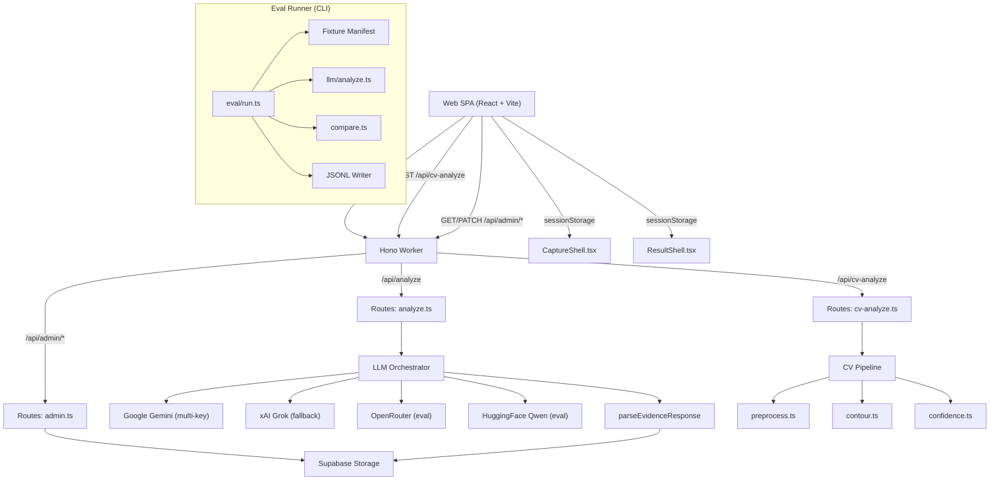

*Caption: High-level system architecture showing the Hono Worker as central hub connecting the React SPA, LLM providers, CV pipeline, and Supabase storage. The eval runner operates as a separate CLI process.*

---

## 5. Worker (Cloudflare Worker — Hono)

### 5.1 Entry Point: `worker/src/index.ts`

Uses Hono framework to define routes:

| Route | Handler | Description |
|-------|---------|-------------|
| `GET /api/health` | Inline | Returns `{ ok: true }` |
| `POST /api/analyze` | `analyzeRoute` | LLM-based oil level analysis |
| `POST /api/cv-analyze` | `cvAnalyzeRoute` | CV pipeline analysis |
| `GET /api/admin/analyses` | `listAnalysesRoute` | List persisted analyses |
| `PATCH /api/admin/analyses/:id` | `patchAnalysisRoute` | Correct an analysis |
| `POST /api/admin/upload` | `manualUploadRoute` | Manual upload with ground truth |

Route prefix matching: `/api/*` → 404 JSON, everything else → `ASSETS.fetch()` (SPA).

### 5.2 Environment: `worker/src/env.ts`

**Interface `Env`** defines all Worker bindings:
- `ASSETS`: Static Assets fetcher (for SPA)
- `ADMIN_TOKEN`: Bearer token for admin routes
- `GEMINI_API_KEY`, `GEMINI_API_KEYS`, `GEMINI_API_KEY2_4`: Gemini keys
- `GROK_API_KEY`, `GROK_MODEL_ID`: Grok fallback
- `HF_API_KEY`: HuggingFace API key
- `OPENROUTER_API_KEY`, `OPENROUTER_MODEL_ID`: OpenRouter
- `MODEL_ID`: Default model ID (defaults to `"gemini-2.5-flash"`)
- `SUPABASE_*`: Supabase connection
- `loadEnv()`: Loads from `process.env` for CLI usage (eval runner)

### 5.3 Routes

#### 5.3.1 `worker/src/routes/analyze.ts` — `POST /api/analyze`

**Request:** `{ bottleSize: "1.5L", imageBase64: "data:image/jpeg;base64,..." }`
**Response:** `AnalysisResultContract` with `analysisId`

**Flow:**
1. Validate request body via `AnalysisRequestSchema`
2. Validate bottle size is 1.5L (return 422 otherwise)
3. Build Gemini key pool via `buildGeminiKeyPool(env)`
4. Call `analyzeWithFallback(env, keyPool, imageBase64)`:
   - **Primary:** `callGeminiWithRetry()` — up to `Math.min(2, keyPool.length)` attempts with 1s backoff
   - **Fallback:** Grok via `callGrok()` — only if all Gemini attempts failed and `GROK_API_KEY` is set
5. Parse raw LLM text via `parseEvidenceResponse()`
6. Validate via `AnalysisResultSchema`
7. Persist to Supabase via `createAnalysisStorage(env).saveAnalysis()`
8. Return result with `analysisId`

**Utility Functions:**
- `stripDataUrlPrefix(value)`: Removes `data:image/...;base64,` prefix
- `readMimeType(value)`: Extracts MIME type from data URL
- `analyzeWithFallback()`: Gemini → Grok orchestrator
- `callGeminiWithRetry()`: Multi-attempt Gemini with key rotation

**Prompts (inline for HTTP route):**
- `SYSTEM_TEXT`: "You estimate remaining oil in a 1.5L Afia cooking-oil bottle from one front-side image..."
- `USER_TEXT`: "Estimate the visible oil level... First describe your visual reasoning, then return evidence JSON..."

#### 5.3.2 `worker/src/routes/cv-analyze.ts` — `POST /api/cv-analyze`

**Request:** `{ imageBase64: "...", bottleSizeMl?: 1500 }`
**Response:** `{ remainingMl, category, confidence, tier, diagnostics, errors }`

**Flow:**
1. Validate `imageBase64` required
2. Validate MIME type (JPEG, PNG, or WebP)
3. Check decoded file size ≤ 10MB
4. Decode base64 to `ArrayBuffer`
5. Validate `bottleSizeMl` is positive finite number
6. Run `runPipeline({ imageData, bottleSizeMl, imageBase64, geminiApiKey })`
7. Return normalized result

#### 5.3.3 `worker/src/routes/admin.ts` — Admin Routes

All admin routes require `Authorization: Bearer <ADMIN_TOKEN>` header.

**`GET /api/admin/analyses`** — List analyses:
- `?limit=N` query param (default 50, max 200)
- Returns `{ analyses: AnalysisRecord[] }`

**`PATCH /api/admin/analyses/:id`** — Update correction:
- Body: `{ correctionStatus, adminFlag, adminCorrectedMl, adminNote }`
- Returns updated `AnalysisRecord`

**`POST /api/admin/upload`** — Manual upload:
- Body: `{ bottleSize, imageBase64, remainingMl, adminNote }`
- Saves as `manual_corrected` status
- Returns created record with 201

**Helper Functions:**
- `requireAdmin(c)`: Returns 401 if `Authorization` header doesn't match `ADMIN_TOKEN`
- `parseLimit(value)`: Parses limit param with bounds checking
- `parseAdminPatch(value)`: Validates patch body
- `parseManualUpload(value)`: Validates upload body
- `objectValue`, `stringValue`, `nonEmptyString`, `integerAtLeastZero`, `nullable`: Inline validators

### 5.4 LLM Layer

#### 5.4.1 `worker/src/llm/analyze.ts` — Multi-Provider Orchestration (Eval)

The eval-focused orchestrator used by the CLI runner. **Provider priority:**

| Priority | Provider | Model |
|----------|----------|-------|
| 1 | OpenRouter | `env.OPENROUTER_MODEL_ID` or `"meta-llama/llama-3.2-11b-vision-instruct"` |
| 2 | HuggingFace Qwen | `Qwen/Qwen2.5-VL-72B-Instruct` (no reference images — payload size limit) |
| 3 | Google Gemini | `env.MODEL_ID` with multi-key rotation |

**`analyzeFixture(imagePath, env, promptVersion)`:**

1. Load prompt via `loadPrompt(version)` — includes system text, user text, few-shots
2. Read image file, convert to base64
3. Load reference images (few-shot images as base64)
4. Try providers in priority order:
   - **OpenRouter**: Full request with reference images, 3 retries on error
   - **HuggingFace Qwen**: Strips reference images (payload size limit), 3 retries with exponential backoff
   - **Gemini**: Multi-key rotation with `isRetryableKeyError()` check (403 = leaked key, 429 = quota)
5. Parse response via `parseEvidenceResponse()`
6. Return `{ rawOutput, parsed, parseErr, prompt }`

**Key Design Decisions:**
- Reference images are included for OpenRouter (supports multi-image)
- Reference images are STRIPPED for HuggingFace (1MB-5MB payload limit)
- 403 errors are retried (key was leaked/revoked) — different keys may work
- Console-logs each provider attempt for debugging

### Diagram: Provider Orchestration (Eval Fixture Flow)

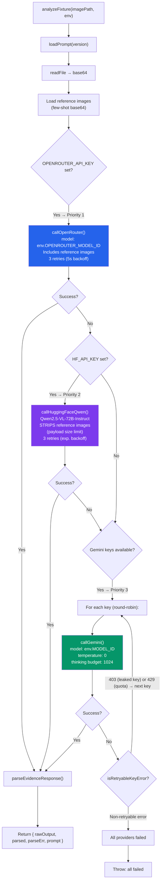

*Caption: Eval fixture provider orchestration — tries OpenRouter first (with reference images), then HF Qwen (strips references due to payload limits), then Gemini with multi-key round-robin rotation.*

#### 5.4.2 `worker/src/llm/gemini.ts` — Google Gemini Client

Uses `@google/generative-ai` SDK.

**`callGemini(args)`:**

1. Create `GoogleGenerativeAI` client with API key
2. Get generative model with:
   - `systemInstruction`: System text
   - `temperature: 0` (deterministic)
   - `maxOutputTokens: 4096`
   - `thinkingConfig`: `{ thinkingBudget: 1024 }` (for thinking models like Gemini 2.5 Flash)
3. Build parts array:
   - Reference images as `inlineData` (optional)
   - Target image as `inlineData`
   - Text prompt with user instructions + reference labels
4. Retry loop: up to 4 attempts with:
   - `extractRetryDelayMs()`: Reads `RetryInfo` from error details or parses "retry in Xs" from message
   - Exponential backoff: `retryDelayMs ?? attempt * 15000`
   - Only retries on 429 / quota / rate-limit errors
5. Handle multi-part output (thinking models):
   - If candidate has `thought` parts, prepend `THOUGHT:\n...\n\nRESPONSE:\n...` format
6. Return raw text

**Interface `GeminiReferenceImage`:**
```typescript
{ label: string; mimeType: string; data: string }
```

#### 5.4.3 `worker/src/llm/grok.ts` — xAI Grok Client

**`callGrok(args)`:**

1. POST to `https://api.x.ai/v1/chat/completions`
2. Body: OpenAI-compatible chat format
   - `temperature: 0`
   - `response_format: { type: "json_object" }`
   - System message + user message with text and image URL
3. On non-200: throw with status + response text
4. Parse from `choices[0].message.content`
5. Supports injectable `fetchImpl` for testing
6. `toDataUrl()` helper ensures base64 data has proper `data:` prefix

#### 5.4.4 `worker/src/llm/rotation.ts` — Gemini Key Rotation

**`buildGeminiKeyPool(env)`:**
- Collects keys from: `GEMINI_API_KEYS` (CSV), `GEMINI_API_KEY`, `GEMINI_API_KEY2`, `GEMINI_API_KEY3`, `GEMINI_API_KEY4`
- Deduplicates via `unique()` helper
- Returns deduplicated string array

**`selectGeminiKey(keys, attempt)`:**
- Round-robin selection: `keys[attempt % keys.length]`

**Helpers:**
- `splitKeys(value)`: Splits CSV string, trims whitespace, filters empty
- `unique(values)`: Deduplicates using Set, preserves falsy filtering

### 5.5 Prompt Layer

#### 5.5.1 `worker/src/prompt/load.ts` — Loader + Hashing

**Interfaces:**
- `FewShot`: `{ imagePath, expected: { readingPossible, meniscusVisible, oilSurfaceYRatio, nearestReferenceMl, qualityFlags, confidence } }`
- `LoadedPrompt`: `{ systemText, userText, fewShots, promptHash, fewshotHash, promptVersion }`

**`loadPrompt(version)`:**
1. Reads `system.md` and `bottle-reference.md` from `<version>/` directory
2. Reads all `.json` files from `<version>/few-shots/` directory (sorted)
3. Computes:
   - `promptHash`: SHA-256 (hex, first 16 chars) of `systemText + "\n---\n" + userText`
   - `fewshotHash`: SHA-256 (hex, first 16 chars) of `JSON.stringify(fewShots)`
4. Returns `LoadedPrompt`

#### 5.5.2 `worker/src/prompt/v1/system.md` — System Instruction

The system prompt tells the LLM it's a "precise visual measurement assistant." Key directives:
- Primary task is measurement, not guesswork
- Must provide "### Visual Reasoning" section BEFORE the JSON output
- Must describe meniscus location (e.g., "dark curved line at the shoulder")
- Must only use visible boundary evidence
- Must not infer from label artwork or brand colors

#### 5.5.3 `worker/src/prompt/v1/bottle-reference.md` — User/Bottle Reference

Detailed measurement protocol:
- Coordinate system: Y=0 (cap), Y=1 (base), usable oil column Y=0.18 to Y=0.96
- Must locate visible oil-air boundary (meniscus) first
- **Anti-Pattern Warning:** "Few-Shot Ghosting" — repeating a few-shot's value because it seems "close enough"
- **Anti-Pattern Warning:** "Label Snapping" — snapping to label horizontal lines instead of actual liquid surface
- Must interpolate —  every image is slightly different
- Confidence guidance:
  - ≥0.85: bottle fully visible, boundary clearly seen
  - 0.50-0.84: somewhat visible with mild glare/crop/label interference
  - <0.50: boundary largely hidden
- Output schema: `{ visualReasoning, readingPossible, meniscusVisible, oilSurfaceYRatio, nearestReferenceMl, qualityFlags, confidence }`

#### 5.5.4 Few-Shot Examples

**5 visible** (in `worker/src/prompt/v1/few-shots/`):

| File | Image | Expected Y | Expected ml |
|------|-------|-----------|-------------|
| `empty.json` | `oil-bottle-frames/1.5L_refs/empty.jpg` | 0.96 | 0 |
| `full-1500.json` | `oil-bottle-frames/1.5L_refs/1500ml.jpg` | 0.18 | 1500 |
| `high-1210.json` | `oil-bottle-frames/1210ml/1210ml_t0041.03s_f0082.jpg` | 0.33 | 1210 |
| `mid-770.json` | `oil-bottle-frames/770ml/770ml_t0000.00s_f0000.jpg` | 0.56 | 770 |
| `low-275.json` | `oil-bottle-frames/275ml/275ml_t0002.50s_f0005.jpg` | 0.82 | 275 |

**7 hidden** (in `worker/src/prompt/v1/few-shots/hidden/`):

| File | Image | Expected Y | Expected ml |
|------|-------|-----------|-------------|
| `vlow-165.json` | `oil-bottle-frames/165ml/...` | 0.87 | 165 |
| `lowmid-385.json` | `oil-bottle-frames/385ml/...` | 0.76 | 385 |
| `midlow-495.json` | `oil-bottle-frames/495ml/...` | 0.70 | 495 |
| `mid-605.json` | `oil-bottle-frames/605ml/...` | 0.65 | 605 |
| `midhigh-935.json` | `oil-bottle-frames/935ml/...` | 0.47 | 935 |
| `highmid-1100.json` | `oil-bottle-frames/1100ml/...` | 0.39 | 1100 |
| `vhigh-1375.json` | `oil-bottle-frames/1375ml/...` | 0.25 | 1375 |

Each has: `readingPossible: true`, `meniscusVisible: "yes"`, `qualityFlags: []`, confidence 0.88-0.95.

### 5.6 CV Pipeline

#### 5.6.1 `worker/src/cv/index.ts` — OpenCV.js Initialization

- Imports `cv` from `@techstark/opencv-js` (WASM-compiled OpenCV)
- `ensureCv()`: Lazily checks `cv.Mat` is constructable, sets `cvReady = true`
- Re-exports `cv` for other modules

#### 5.6.2 `worker/src/cv/pipeline.ts` — Pipeline Orchestrator

**`runPipeline(input)`:**
```
Input → Validate → Preprocess → Contour → Confidence → Output
```

**Stages:**
1. **Validate** (`validateBottle`): Check bottle size is supported (1500ml)
2. **Preprocess** (`preprocess`): Decode image → grayscale → Gaussian blur → CLAHE
3. **Contour** (`detectMeniscus`): Canny edges → findContours → scoring → horizontal edge detection
4. **Confidence** (`scoreConfidence`): Edge clarity + noise penalty + extreme-ratio penalty

**Early exit paths:**
- Validation unsupported → `UNSUPPORTED_BOTTLE`
- Preprocess fails → `PERSPECTIVE_FAILED` (recoverable)
- No contour found → `CONTOUR_NOT_FOUND`
- Contour ratio implausible (< -0.5 or > 1.5) → `IMPLAUSIBLE_RATIO`
- No meniscus edge → `no_meniscus_edge`

**Category Mapping** (`ratioToCategory`):
| Ratio Range | Category |
|-------------|----------|
| < 0.125 | Empty |
| 0.125 - 0.375 | Quarter |
| 0.375 - 0.625 | Half |
| 0.625 - 0.875 | Three Quarter |
| ≥ 0.875 | Full |

### Diagram: CV Pipeline Stages

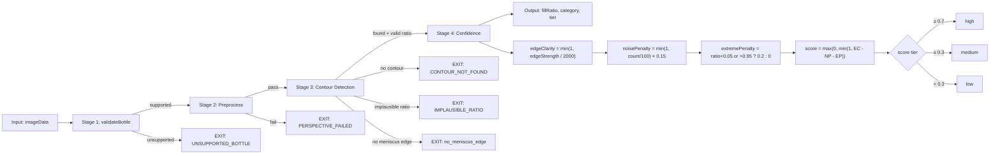

*Caption: CV pipeline showing the four sequential stages with early-exit paths for each failure mode. Confidence scoring combines edge clarity, noise penalty, and extreme-ratio penalty.*

#### 5.6.3 `worker/src/cv/preprocess.ts` — Image Preprocessing

**`mimeType(buf)`:**
- Magic byte detection: JPEG (FF D8), PNG (89 50), WebP (RIFF + WEBP)

**`decodeImage(buf)`:**
- JPEG: `jpeg-js` with `useTArray: true`
- PNG: `pngjs` via `PNG.sync.read()`
- WebP: Falls back to JPEG decoder

**`preprocess(imageData)`:**
1. `ensureCv()` — ensure OpenCV.js loaded
2. Decode image bytes to RGBA pixels
3. Create `cv.Mat` from image data
4. `cv.cvtColor(src, gray, COLOR_RGBA2GRAY)` — grayscale conversion
5. `cv.GaussianBlur(gray, blurred, {7,7})` — noise reduction
6. `cv.CLAHE(2.0, {8,8})` — contrast-limited adaptive histogram equalization
7. Returns `{ gray, blurred, equalized, width, height }`

**Memory management:**
- Every `cv.Mat` allocation is paired with `.delete()` in `finally` or `try/catch`
- `releasePreprocessed(p)`: Deletes gray, blurred, equalized mats

#### 5.6.4 `worker/src/cv/contour.ts` — Contour Detection & Meniscus Finding

**`detectMeniscus(preprocessed, bottleSizeMl)`:**
1. Get bottle geometry for the size
2. **Primary: Canny edge detection:**
   - `cv.Canny(equalized, edges, 50, 150, 3)`
   - `cv.findContours(edges, contours, hierarchy, RETR_EXTERNAL, CHAIN_APPROX_SIMPLE)`
3. **Fallback: Adaptive threshold** (if no Canny contours):
   - Extract center 60% ROI
   - `cv.adaptiveThreshold(roi, thresh, 255, ADAPTIVE_THRESH_GAUSSIAN_C, THRESH_BINARY_INV, 15, 3)`
   - Morphological close to fill gaps
   - Find contours on thresholded image
4. Score contours via `scoreContours()` (pure function)
5. Heuristic rejection:
   - Best score < 0.3 → reject
   - Contour area > 50% of frame → reject (false large contour)
6. Find horizontal edges in bottle body:
   - `cv.Sobel(roi, gradY, CV_64F, 0, 1, 3)` — horizontal gradient
   - `cv.reduce(absGradY, rowSums, 1, 0, CV_32S)` — row-sum in WASM
   - Score edges by strength × position bonus (center-weighted)
7. Pick best meniscus edge → convert to fill ratio via `calibrateFillRatio()`
8. Return `ContourResult`

**`findHorizontalEdges(roi)`:**
- Vectorized via OpenCV Sobel + reduce (avoids JS pixel-by-pixel iteration)
- Returns top 5 horizontal edges sorted by strength
- Minimum strength threshold: 100

### Diagram: Contour Detection Algorithm

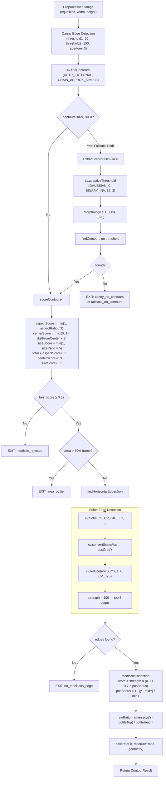

*Caption: Detailed contour detection algorithm showing the primary Canny path, the adaptive threshold fallback, contour scoring formula, Sobel-based horizontal edge detection, and meniscus selection with position-bonus weighting.*

#### 5.6.5 `worker/src/cv/confidence.ts` — Confidence Scoring

**`scoreConfidence(contour)`:**
1. **Edge clarity**: `Math.min(1, edgeStrength / 2000)` — normalized to 0..1
2. **Noise penalty**: `Math.min(1, contourCount / 100) × 0.15` — many contours = noise
3. **Extreme ratio penalty**: 0.2 penalty if ratio < 0.05 or > 0.95 (likely bottle boundary, not meniscus)
4. **Final score**: `max(0, min(1, edgeClarity - noisePenalty - extremePenalty))`

**Tiers:**
| Score | Tier |
|-------|------|
| ≥ 0.7 | high |
| ≥ 0.3 | medium |
| < 0.3 | low |

#### 5.6.6 `worker/src/cv/geometry.ts` — Bottle Geometry

**`BottleGeometry`:** `{ sizeMl, fillTopY, fillBottomY }`
- Currently only 1.5L (1500ml): fillTopY=0.15, fillBottomY=0.85
- Default geometry matches 1.5L

**`calibrateFillRatio(meniscusYRatio, geometry)`:**
```
clamped = clamp(meniscusYRatio, 0, 1)
raw = 1 - (clamped - fillTopY) / (fillBottomY - fillTopY)
return clamp(raw, 0, 1)
```
Converts detected meniscus Y position to a fill ratio (0 = empty, 1 = full).

### Diagram: Fill Ratio Calculation

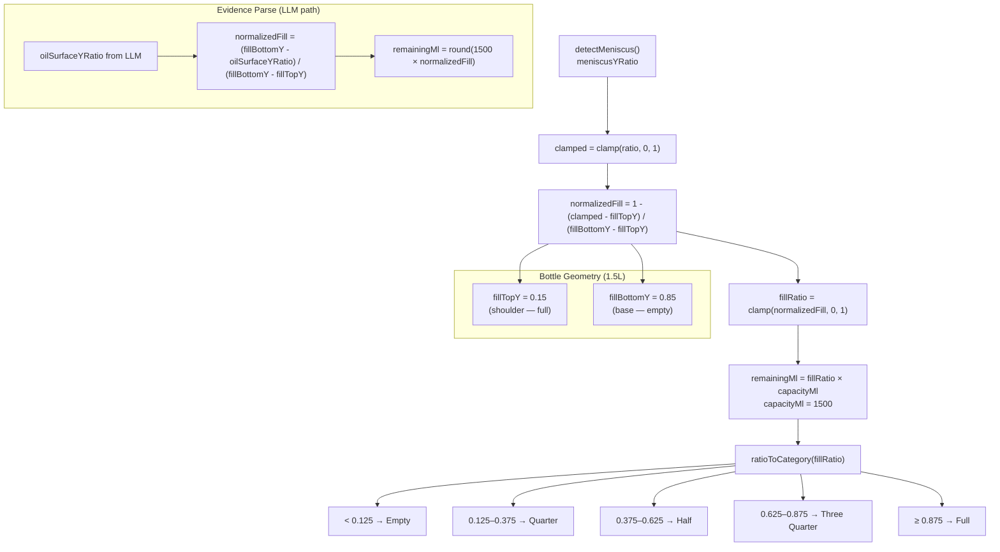

*Caption: Fill ratio calculation from detected meniscus Y position using fixed bottle geometry. The same formula is used by both the CV pipeline (from contour Y) and the LLM path (from oilSurfaceYRatio).*

#### 5.6.7 `worker/src/cv/scoring.ts` — Contour Scoring (Pure Function)

**`scoreContours(contours, imageWidth, imageHeight)`:**
For each contour:
- `aspectScore` = `min(1, aspectRatio / 3)` — tall = bottle-like
- `centerScore` = `max(0, 1 - distFromCenter × 3)` — centered in frame
- `sizeScore` = `min(1, sizeRatio × 5)` — proportionally sized
- `total` = `aspectScore × 0.5 + centerScore × 0.3 + sizeScore × 0.2`
- Returns best if score ≥ 0.3

No OpenCV dependency — pure TypeScript function for testability.

#### 5.6.8 `worker/src/cv/validate.ts` — Bottle Size Validation

**`validateBottle(bottleSizeMl)`:**
- Currently only supports 1500ml (1.5L)
- Returns `{ sizeMl, supported, message? }`

#### 5.6.9 `worker/src/cv/analyse.ts` — Mean/StdDev Analysis

**`analyse(gray)`:**
- `cv.meanStdDev(gray, mean, stdDev)` — computes mean and standard deviation of grayscale image
- Returns `{ mean, stdDev }` as scalar values

#### 5.6.10 `worker/src/cv/template.ts` — Template Matching

**`initTemplates()`:**
- Loads pre-extracted bottle templates from `templates/` directory
- Each template stored as base64-encoded raw grayscale pixels (80×320)
- Applies CLAHE to match pipeline preprocessing
- Caches in module-level `templates[]`

**`matchBottle(equalized, threshold = 0.3)`:**
- Multi-scale matching: tries scales 0.8, 1.0, 1.2
- `cv.matchTemplate()` with `TM_CCOEFF_NORMED`
- Returns best match `{ found, x, y, width, height, score }`

#### 5.6.11 `worker/src/cv/logger.ts` — Structured Pipeline Logging

- `logStage(stage, latencyMs, confidence, decision, error)`: JSON-logged at each pipeline stage
- `logSummary(stages)`: Summarizes all stage latencies
- Uses `console.log(JSON.stringify(...))` — safe for concurrent Workers

#### 5.6.12 `worker/src/cv/errors.ts` — Pipeline Error Types

| Error Factory | Stage | Code | Recoverable |
|--------------|-------|------|-------------|
| `contourNotFound()` | contour | CONTOUR_NOT_FOUND | No |
| `implausibleRatio(n)` | contour | IMPLAUSIBLE_RATIO | No |
| `perspectiveFailed()` | preprocess | PERSPECTIVE_FAILED | Yes |
| `regressionFailed(e)` | regression | REGRESSION_FAILED | Yes |
| `llmTimeout()` | llm_validation | LLM_TIMEOUT | Yes |
| `internalError(e)` | pipeline | INTERNAL_ERROR | No |

### 5.7 Eval Framework

#### 5.7.1 `worker/src/eval/run.ts` — Eval Runner CLI

Entry point for `pnpm eval:dev` and `pnpm eval:holdout`.

**CLI Arguments:**
- `--set=dev|holdout`: Which manifest to use
- `--manifest=path`: Custom manifest path
- `--label=name`: Custom run label

**Flow:**
1. Read manifest JSON
2. If holdout: increment `holdoutTouches` counter (seal violation tracking)
3. Load env via `loadEnv()`
4. Generate `runId` (UUID) and `runStartedTs`
5. For each fixture:
   - Call `analyzeFixture(fx.imagePath, env)`
   - Compare via `compareMl()`
   - Write run-record to JSONL file
   - Track per-stratum stats
   - **Rate limit:** 60s delay between fixtures (3 keys × 180s each)
6. Print summary:
   - Exact/close accuracy
   - Per-stratum accuracy
   - Per-source accuracy (real vs aug)
   - Per-fill-bucket accuracy
   - Average confidence and error
   - High-confidence misses (≥0.80 confidence but not exact)
   - Confusion bands (low→mid, mid→high, etc.)
   - Worst 5 misses with raw output excerpts

#### 5.7.2 `worker/src/eval/manifest.ts` — Fixture Manifest Sampler

**Types:**
- `Source`: `"real" | "aug"`
- `FillBucket`: `"empty-low" | "mid-low" | "mid-high" | "high"`
- `FrameBucket`: `"early" | "late" | "aug"`
- `FixtureEntry`: `{ imageId, imagePath, groundTruthMl, source, fillBucket, frameBucket, stratum }`

**Stratification (4 axes):**
1. Source: real (video frames) or aug (AI-augmented)
2. Fill level: empty-low (0-275ml), mid-low (330-770ml), mid-high (825-1210ml), high (1265-1500ml)
3. Frame timing: early (<5s), late (≥5s) — real frames only
4. Random: seeded per cell

**`fillBucket(ml)`:**
| ml | Bucket |
|----|--------|
| ≤ 275 | empty-low |
| 276 - 770 | mid-low |
| 771 - 1210 | mid-high |
| ≥ 1211 | high |

### Diagram: Fixture Stratification

```mermaid
mindmap
  root((Fixture Stratification<br/>4 Axes))
    Source["Source"]
      real["real (video frames)<br/>~1,148 images"]
      aug["aug (AI-augmented)<br/>~14,924 images"]
    FillLevel["Fill Level"]
      empty-low["empty-low<br/>(0-275ml)"]
      mid-low["mid-low<br/>(276-770ml)"]
      mid-high["mid-high<br/>(771-1210ml)"]
      high["high<br/>(≥1211ml)"]
    FrameBucket["Frame Timing<br/>(real only)"]
      early["early<br/>(<5 seconds)"]
      late["late<br/>(≥5 seconds)"]
    SampleId["Sampling"]
      seed["Seed: 20260507<br/>Mulberry32 PRNG"]
      shuffle["Stratum shuffle →<br/>round-robin pull"]
  Partitioning["Partitioning"]
    dev["dev: 60 fixtures"]
    holdout["holdout: 40 fixtures"]
  Seal["Holdout Seal"]
    touchCounter["holdoutTouches counter<br/>increments each run"]
    byteStable["Byte-stability check<br/>≥38/40 across 3 runs"]
```

*Caption: Fixture stratification across 4 axes — source (real/aug), fill level (4 buckets), frame timing (early/late/aug), and seeded random sampling. 100 total fixtures split 60 dev / 40 holdout with seal violation tracking.*

**`sampleManifest(args)`:**
1. List all fixtures from `framesRoot` (real) and `augRoot` (aug)
2. Group by stratum
3. Shuffle within each stratum using seeded PRNG (Mulberry32)
4. Round-robin pull from strata to fill dev (60) and holdout (40)
5. Return `SampledManifest` with dev, holdout arrays and cell counts

**Seeded PRNG (Mulberry32):**
- Seed: `20260507` (date of initial manifest creation)
- `rng(seed)` returns a deterministic `() => number` function

#### 5.7.3 `worker/src/eval/build-manifest.ts` — Manifest Builder

One-shot script to generate and write dev/holdout manifests:
- 60 dev + 40 holdout fixtures
- Seed: `20260507`
- Sources: `oil-bottle-frames` (real), `oil-bottle-augmented` (aug)
- Writes to `worker/test/fixtures/{dev,holdout}/manifest.json`

#### 5.7.4 `worker/src/eval/compare.ts` — ML Comparator

**`compareMl(predicted, groundTruth)`:**
```
absErrorMl = |predicted - groundTruth|
exactBucketPass: absErrorMl ≤ 55 (EXACT_TOLERANCE_ML)
closeBucketPass: absErrorMl ≤ 110 (CLOSE_TOLERANCE_ML)
```

**Identity:** `COMPARATOR_NAME = "ml-bucket-tolerance"`, `COMPARATOR_VERSION = "1.0.0"`

### Diagram: Comparator Decision Tree

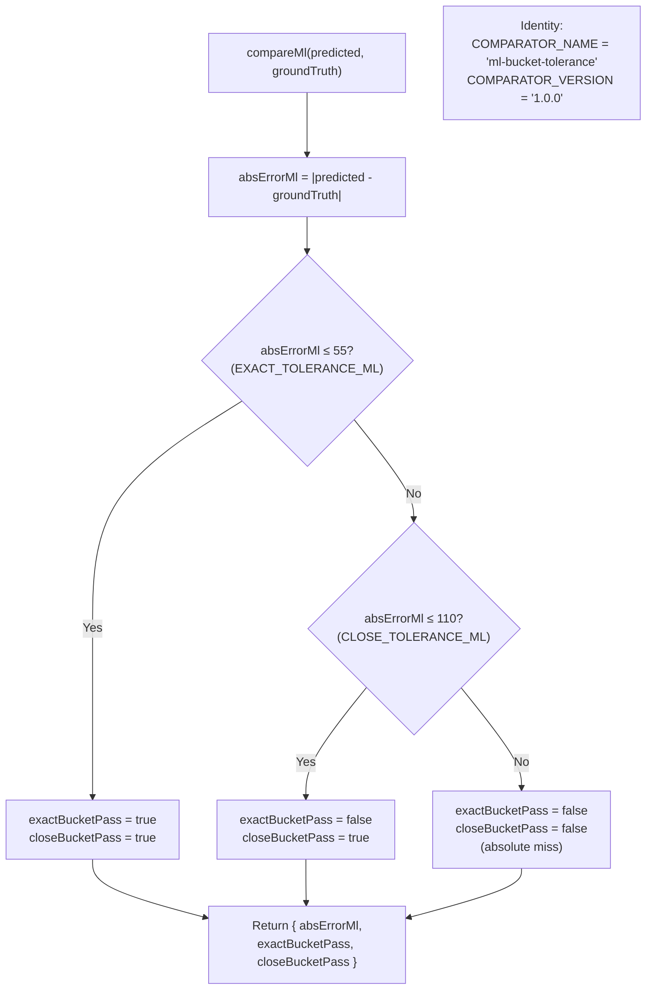

*Caption: Comparator decision tree — checks exact (±55ml, one quarter-cup) then close (±110ml, two quarter-cups) tolerance. Ground truth is from the fixture folder name.*

#### 5.7.5 `worker/src/eval/parse-response.ts` — LLM Response Parser

Two parsing paths:

**`parseAnalysisResponse(raw)`:**
- Schema: `{ remainingMl, consumedMl, redLineYRatio, confidence }`
- Used by earlier analysis path (HTTP route)

**`parseEvidenceResponse(raw)`:**
- Schema: `{ visualReasoning?, readingPossible, meniscusVisible, oilSurfaceYRatio, nearestReferenceMl, qualityFlags, confidence }`
- **Derives `remainingMl` from `oilSurfaceYRatio`**:
  ```
  normalizedFill = (fillBottomY - oilSurfaceYRatio) / (fillBottomY - fillTopY)
  remainingMl = BOTTLE_1_5L.capacityMl * normalizedFill
  ```
- This is the key design: model detects the oil-air boundary Y position, and extraction derives ml programmatically from fixed geometry — not a model-guessed percentage

**JSON Extraction Logic:**
1. Try to find ```json ... ``` code block
2. Fallback: find first `{` and last `}`
3. Parse via `JSON.parse()`

**Helper:**
- `ratioFromOilSurface(oilSurfaceYRatio)`: Converts oil surface Y ratio (0=cap, 1=base) to fill ratio (0=empty, 1=full)
- `clamp(n, lo, hi)`: Bounds a value

#### 5.7.6 `worker/src/eval/jsonl.ts` — JSONL Writer

**`writeRunRecord(path, rec)`:**
- Appends a single JSON line to file via `appendFile`
- One `RunRecord` per fixture per run

#### 5.7.7 `worker/src/eval/signoff.ts` — Stage 1 Exit Gate

**Sign-off process (interactive CLI):**

1. **Find holdout runs:** Reads last 3 JSONL files matching `_holdout_` pattern
2. **Check aggregate:** ≥90% exact-bucket accuracy
3. **Check per-stratum:** ≥80% on each stratum
4. **Check byte-stability:** ≥38/40 fixtures produce identical `rawOutput` across all 3 runs
5. If metrics fail → exit with code 1 ("Iterate prompt/few-shots on dev set")
6. If metrics pass → interactive reviewer sign-off:
   - Prompts for reviewer name
   - Prompts for decision (yes/no)
   - Optional notes
7. Records sign-off to `runs/signoffs.jsonl`
8. On "yes": prints "Stage 1 PASS. Tag with: `git tag stage1/passed`"

#### 5.7.7a Guardrail Verification (Regression Detection Proof)

**Proven: `eval:dev-quick` detects regressions.**

Test date: 2026-05-15

**Method:** A deliberate break was injected into `analyzeFixture()` to short-circuit the LLM pipeline and return a hardcoded wrong result (`oilSurfaceYRatio: 0.44` → `remainingMl: 1000`). The 12-fixture probe manifest was run via `eval:dev-quick`.

**Results with broken pipeline:**

| Metric | Value |
|--------|-------|
| exact (±55ml) | **0/12 = 0.0%** |
| close (±110ml) | **0/12 = 0.0%** |
| avg confidence | **0.00** |
| avg abs error | **443.3ml** |
| worst miss | 1000ml (empty → 1000) |

All 12 strata and all 4 fill-buckets reported 0.0%. The confusion bands showed `low→high: 3` and `mid→high: 5` — catastrophic misclassifications. The `runs/*.jsonl` output captured full per-fixture detail for post-mortem analysis.

**Failure signal:** `eval:dev-quick` exits with 0 (it reports results, it does not fail on low accuracy), but the console output provides unambiguous regression signals:
- `exact: 0/12 = 0.0%` (vs expected baseline of ~50%+)
- `close: 0/12 = 0.0%` (vs expected ~70%+)
- Per-stratum all at 0%
- Worst misses with error > 500ml
- `high-confidence misses: 0` (confidence also tanked)

**In CI/CD context:** A downstream workflow or signoff gate can parse these numbers and fail the build if exact-rate drops below a threshold (e.g., < 20%).

**Cleanup:** The break was applied, tested, reverted. No trace left in the working tree.

#### 5.7.8 `worker/src/eval/cv-eval.ts` — CV Pipeline Eval Runner

Evaluates the CV pipeline against fixture manifests.

**Flow:**
1. Read CV eval manifest (default: `worker/test/fixtures/cv-eval/manifest.json`)
2. For each fixture: run `runPipeline()` → compare to ground truth
3. Outputs:
   - JSON results file to `runs/cv-eval-200/`
   - Console summary with:
     - Exact/close accuracy
     - Contour found rate
     - Latency percentiles (avg, p50, p95, p99)
     - Per-confidence-tier accuracy
     - Per-fill-bucket accuracy
     - MAE per tier
     - Confusion bands
     - 95% Wilson confidence interval for exact accuracy
     - Miss reason distribution
     - Worst 5 misses
4. **Regression check:** Compares against `BASELINE_RUN` if set

#### 5.7.9 `worker/src/eval/ablation-test.ts` — CV Ablation Test

Tests 5 images at different fill levels:
- Empty (0ml), Quarter (275ml), Half (660ml), Three Quarter (990ml), Full (1485ml)

Reports per-image: predicted ml, category match, confidence, tier, contour found, edge strength, latency.

#### 5.7.10 `worker/src/eval/build-edge-eval.ts` — Edge-Case Manifest Builder

Creates a curated manifest of 20 edge cases covering known failure modes:
- **Empty bottles** (3): uniform light, dark background, side light
- **Low fill** (4): meniscus at shoulder, dark frame, overexposed, label overlap
- **Mid fill** (6): no contour, glare — covers 495ml through 880ml
- **High fill** (4): no contour — covers 1100ml through 1430ml
- **Full bottles** (2): shoulder reflection, dark
- **Known good** (3): 440ml, 880ml, 1375ml — for contrast

#### 5.7.11 `worker/src/eval/extract-templates.ts` — Bottle Template Extraction

Extracts 80×320 grayscale ROI templates from known-good images using `sharp`:
- 440ml frame: crop at (215, 50, 100, 370)
- 605ml frame: crop at (200, 40, 110, 380)
- 880ml frame: crop at (190, 60, 120, 360)

Saves to `worker/src/cv/templates/` as JSON with base64 pixel data.

#### 5.7.12 `worker/src/eval/probe-gemini-frame.ts` — Quick Gemini Probe

One-shot script that:
1. Lists all images from `oil-bottle-frames` (excluding references)
2. Picks a random image
3. Calls Gemini with reference images (1500ml, 750ml, 55ml, empty)
4. Parses response and compares to ground truth
5. Outputs full JSON: path, references, ground truth, raw output, parsed, comparison

### 5.8 Storage

#### 5.8.1 `worker/src/storage/supabase.ts` — Supabase Client

**`createAnalysisStorage(env, clientFactory)`:**
- Creates Supabase client with service role key
- Returns an object with methods:

**`listAnalyses(input)`:**
- SELECT * FROM analyses ORDER BY created_at DESC LIMIT N
- Transforms snake_case records to camelCase via `fromSupabaseAnalysisRecord()`

**`updateAnalysisCorrection(id, input)`:**
- UPDATE analyses SET correction_status, admin_flag, admin_corrected_ml, admin_note WHERE id = ?
- Validates via `SupabaseAnalysisRecordSchema`

**`saveAnalysis(input)`:**
1. Decode base64 image → upload to Supabase Storage
2. Get public URL from storage
3. INSERT record into `analyses` table
4. Return created record

**`saveManualUpload(input)`:**
1. Upload to `manual/` storage path
2. Create AnalysisRecord with `manual_corrected` status
3. INSERT and return

**Helpers:**
- `required(value, name)`: Throws if value is falsy
- `decodeImage(value)`: Parses data URL → `{ bytes, mimeType }`
- `extensionForMimeType(mimeType)`: Maps to file extension
- `fromSupabaseAnalysisRecord(record)`: Snake → camelCase
- `createSupabaseAnalysisRecord(input)`: Creates the DB-ready record

### Diagram: Supabase Storage Operations

```mermaid
flowchart TD
    subgraph SAVE["saveAnalysis()"]
        S1["decodeImage(imageBase64)<br/>{ bytes, mimeType }"]
        S2["Upload to bucket<br/>path: analyses/{id}.{ext}"]
        S3["getPublicUrl(path)"]
        S4["INSERT into analyses table<br/>correctionStatus: pending_review"]
        S1 --> S2 --> S3 --> S4
    end

    subgraph UPDATE["updateAnalysisCorrection()"]
        U1["UPDATE analyses SET<br/>correction_status, admin_flag,<br/>admin_corrected_ml, admin_note"]
        U2["WHERE id = ?"]
        U3["Return camelCase AnalysisRecord"]
        U1 --> U2 --> U3
    end

    subgraph LIST["listAnalyses()"]
        L1["SELECT * FROM analyses"]
        L2["ORDER BY created_at DESC"]
        L3["LIMIT N (default 50, max 200)"]
        L4["snake_case → camelCase transform"]
        L1 --> L2 --> L3 --> L4
    end

    subgraph MANUAL["saveManualUpload()"]
        M1["Upload to manual/{id}.{ext}"]
        M2["Create record with<br/>correctionStatus: manual_corrected<br/>adminFlag: manual"]
        M3["INSERT and return"]
        M1 --> M2 --> M3
    end
```

*Caption: Four Supabase storage operations — saveAnalysis (upload + insert with pending_review status), updateAnalysisCorrection (PATCH by ID), listAnalyses (sorted by created_at, limited), and saveManualUpload (manual_corrected status).*

---

## 6. Web (React SPA)

### 6.1 Entry Point: `web/src/main.tsx`

Creates React root with providers:
```
React.StrictMode > I18nProvider > ThemeProvider > BrowserRouter > App
```

### 6.2 Routing: `web/src/App.tsx`

| Route | Component | Description |
|-------|-----------|-------------|
| `/` | Redirect → `/scan?size=1.5L` | Root redirect |
| `/mock-qr` | `MockQrPage` | Dev QR code generator |
| `/scan` | `ScanShell` | QR scan + camera capture |
| `/result` | `ResultShell` | Analysis result display |
| `/admin` | `AdminShell` | Admin review + upload |

`FloatingControls` rendered globally outside Routes.

### 6.3 Localization: `web/src/i18n.tsx`

**`I18nProvider`:**
- Supports `"en"` (English) and `"ar"` (Arabic)
- Dictionary with 5 keys: capture.title, capture.button, capture.hint, result.consumed, result.remaining
- Persists to `localStorage` under key `"lang"`
- Sets `html.lang` and `html.dir` (rtl for Arabic)
- `useI18n()` hook returns `{ lang, t(key), toggle }`

### 6.4 Theme: `web/src/theme.tsx`

**`ThemeProvider`:**
- Supports `"light"` and `"dark"` themes
- Persists to `localStorage` under key `"theme"`
- Toggles `html.classList` with `"dark"`
- `useTheme()` hook returns `{ theme, toggle }`

### 6.5 Error System: `web/src/errors.ts`

**Error Codes:** `ERROR_CODES`:
- `ANALYSIS_FAILED`: Analysis pipeline failure
- `NETWORK_ERROR`: Network error
- `API_ERROR`: API error status
- `CAPTURE_FAILED`: Camera capture failed

**Interfaces:**
- `ErrorEntry`: `{ code, description }`
- `ErrorResult`: `{ errors[], tier ("error"|"degraded"), confidence, remainingMl }`
- `StoredAnalysisResult`: Union of success result and ErrorResult

**Type guard:** `isErrorResult(result)` — checks for `tier === "error"`
**Utility:** `getSupportEmail()` — reads `VITE_CONTACT_SUPPORT_EMAIL` env var, defaults to `support@afia.co`

### 6.6 Components

#### 6.6.1 `web/src/components/FloatingControls.tsx`

Fixed top-right position (z-50):
- Language toggle: "ع" / "EN"
- Theme toggle: "🌙" / "☀"

#### 6.6.2 `web/src/components/MockQrPage.tsx`

Dev tool to generate mock QR codes:
- Renders for both 1.5L and 2.5L sizes
- Uses `buildMockQrSvg()` from shared package
- Provides clickable "Scan Afia X" links

#### 6.6.3 `web/src/components/ScanShell.tsx`

QR scan landing page:
- Reads `?size=` from URL params
- Validates bottle size (1.5L or 2.5L)
- 1.5L → renders `CaptureShell`
- 2.5L → "Analysis for this size is pending" message
- Unknown → "Scan a valid Afia QR code" error

#### 6.6.4 `web/src/components/CaptureShell.tsx`

Camera capture component with bottle outline overlay.

**Camera States:** `"starting"` → `"ready"` | `"missing"` | `"blocked"` | `"capture-failed"` | `"analyzing"` | `"analysis-failed"`

**Flow:**
1. On mount: request `getUserMedia({ video: { facingMode: "environment" } })`
2. Show live video feed with bottle outline SVG overlay
3. On "Capture" click:
   - Draw video frame to canvas → convert to JPEG data URL
   - Store in `sessionStorage` under `"afia.capture"`
   - POST to `/api/analyze`
   - Store result in `sessionStorage` under `"afia.analysis"`
   - Navigate to `/result`
4. On analysis failure: persist structured error state, navigate to `/result?retry=true`

### Diagram: Camera State Machine

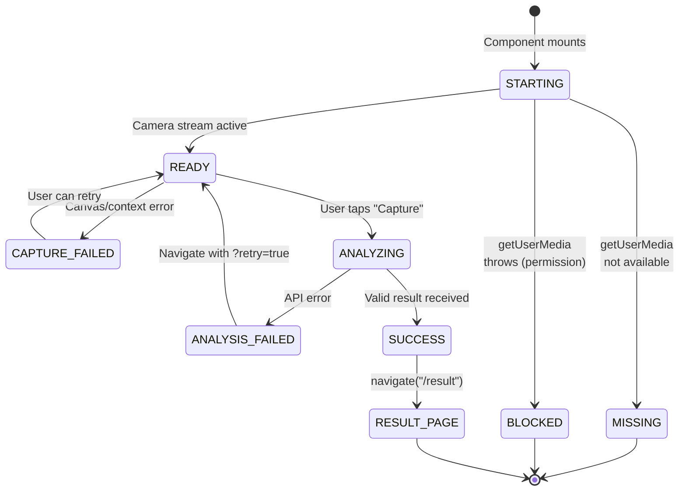

*Caption: CaptureShell state machine — transitions from starting through ready to analyzing on capture, with error recovery paths back to ready for retry.*

**Bottle Outline:**
- Loaded from SVG file at `oil-bottle-frames/afia-bottle-clean.svg`
- Positioned: `left: 50%`, `top: 15%`, `height: 56%`, `width: 40%`
- Opacity 45%, pointer-events-none

**Error Handling:**
- All four camera error states render contextual error messages
- Analysis failure stores error context with support email for mailto: link

#### 6.6.5 `web/src/components/ResultShell.tsx`

Result display with captured image, red line overlay, ML slider, cup counter.

**Data Sources:**
- `sessionStorage.getItem("afia.capture")` — captured image
- `sessionStorage.getItem("afia.analysis")` — analysis result or error state
- `sessionStorage.getItem("afia.errorContext")` — error details for support

**States:**
1. **Fatal error** (`isErrorResult`): Error description, error code, "Retry Scan" link, "Contact Support" mailto:, captured image below
2. **Normal result**: Bottle image with red line overlay + OilLevelSlider + CupCounter + metrics
3. **No data**: "No analyzed camera capture found" + "Return to Scan" link

**OilLevelSlider:**
- Vertical slider (ARIA role="slider", orientation="vertical")
- Thumb position represents oil level Y ratio
- Adjusts in 55ml steps (snapMl)
- Pointer events: pointerDown captures, pointerMove updates
- Keyboard: ArrowUp/Down (±55ml), PageUp/Down (±55ml), Home (0), End (max)
- Rail displayed as vertical track with fill range indicators

**CupCounter:**
- Visual cup showing fill level (25% per quarter)
- Label: e.g., "2 1/2 Cups consumed"
- Whole number displayed inside cup fill
- Quarters: 1/4, 1/2, 3/4, then switches to whole cups

### Diagram: ResultShell State Machine

```mermaid
stateDiagram-v2
    [*] --> CHECK_DATA: Component mounts
    CHECK_DATA --> NO_DATA: sessionStorage<br/>"afia.analysis" is null
    CHECK_DATA --> ERROR_STATE: isErrorResult = true
    CHECK_DATA --> NORMAL_RESULT: valid AnalysisResultContract

    NO_DATA --> SHOW_NO_DATA: "No analyzed camera<br/>capture found" card
    SHOW_NO_DATA --> SCAN_PAGE: "Return to Scan" link

    ERROR_STATE --> SHOW_ERROR: Error code + description
    SHOW_ERROR --> RETRY_SCAN: "Retry Scan" link
    SHOW_ERROR --> CONTACT_SUPPORT: "Contact Support" mailto:

    NORMAL_RESULT --> SHOW_NORMAL: Bottle image + red line +<br/>OilLevelSlider + CupCounter
    SHOW_NORMAL --> ADJUST_SLIDER: Pointer/keyboard interaction
    SHOW_NORMAL --> RETAKE: "Retake" link
    ADJUST_SLIDER --> SHOW_NORMAL: Updated ml displayed

    SCAN_PAGE --> [*]
    RETRY_SCAN --> [*]
    RETAKE --> [*]
```

*Caption: ResultShell state machine driven by sessionStorage content — three main states (no data, error, normal result) with user navigation transitions.*

**Math Functions:**
- `snapMl(value)`: Rounds to nearest 55ml, clamps to 0..SLIDER_MAX_ML
- `mlToYRatio(ml)`: Converts ml to Y ratio (for slider positioning)
- `yRatioToMl(yRatio)`: Converts Y ratio to ml
- `formatCups(consumedMl)`: Converts consumed ml to `CupDisplay { fillPercent, label, wholeLabel }`

**Utilities:**
- `readCapturedImage()`: Reads from sessionStorage, validates data URL format
- `readStoredResult()`: Reads and parses analysis result or error state
- `readErrorContext()`: Reads error context for support
- `buildMailtoHref(context)`: Builds mailto: link with error details

#### 6.6.6 `web/src/components/AdminShell.tsx`

Admin dashboard with two tabs: "Review Queue" and "Manual Upload".

### Diagram: Admin Component Structure

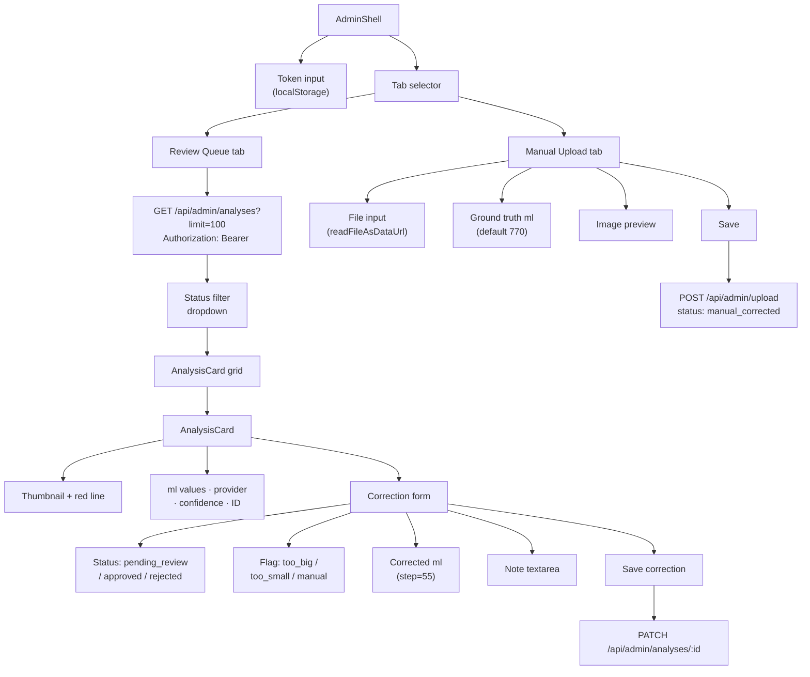

*Caption: Admin shell component hierarchy — two-tab interface with review queue (filterable AnalysisCards with correction forms) and manual upload (file upload with ground truth metadata).*

**Token Management:**
- Admin token stored in `localStorage`
- Password input at top of page
- All API requests include `Authorization: Bearer <token>` header

**Review Queue Tab:**
- Lists analyses fetched from `GET /api/admin/analyses?limit=100`
- Filter by correction status (all, pending_review, approved, rejected, manual_corrected)
- Each card shows: thumbnail image with red line, ml values, provider, confidence, ID
- Correction form: status dropdown, flag dropdown (too_big/too_small/manual), corrected ml input, note textarea
- Save button sends PATCH request

**Manual Upload Tab:**
- File input for bottle image (reads as data URL)
- Ground truth remaining ml input (default 770)
- Note textarea
- Preview of uploaded image
- Save button sends POST to `/api/admin/upload`

**Helpers:**
- `adminHeaders(token)`: Returns `{ authorization }` header or empty
- `readFileAsDataUrl(file)`: FileReader → Promise<string> conversion

---

## 7. Data Flow (End-to-End)

### Consumer Flow:
```
User scans QR code on bottle
    ↓
Opens /scan?size=1.5L
    ↓
ScanShell detects 1.5L → renders CaptureShell
    ↓
Camera feed displayed with bottle outline overlay
    ↓
User taps "Capture"
    ↓
Frame captured to JPEG data URL → stored in sessionStorage
    ↓
POST /api/analyze { bottleSize: "1.5L", imageBase64 }
    ↓
Worker: validate → Gemini (multi-key) → Grok fallback → parse → Supabase save
    ↓
Response: { remainingMl, consumedMl, redLineYRatio, confidence, ... } + analysisId
    ↓
Stored in sessionStorage
    ↓
Navigate to /result?size=1.5L
    ↓
ResultShell: show image + red line overlay + slider + cup counter
    ↓
User can adjust slider in 55ml steps
```

### Diagram: Consumer Flow

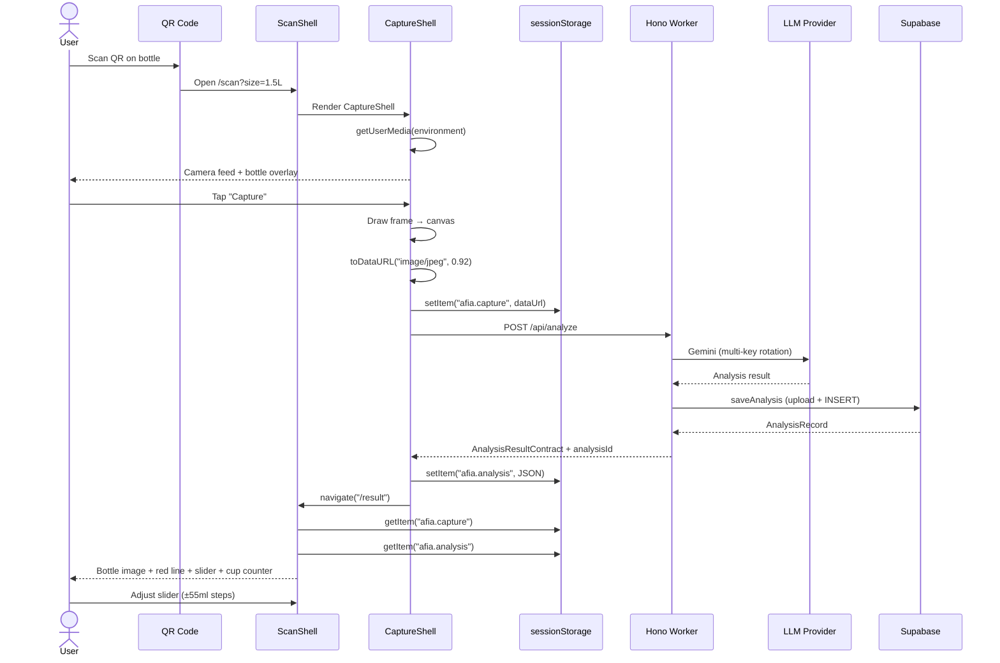

*Caption: Consumer flow from QR scan through camera capture, LLM analysis, Supabase persistence, and result display. sessionStorage is used as the data bus between capture and result components.*

### Admin Flow:
```
Admin navigates to /admin
    ↓
Enters admin token (stored in localStorage)
    ↓
Review Queue: lists analyses, filter by status
    ↓
Click "Save correction" on a card
    ↓
PATCH /api/admin/analyses/:id { correctionStatus, adminFlag, ... }
    ↓
Or: Manual Upload tab
    ↓
Upload image + ground truth ml + notes
    ↓
POST /api/admin/upload → saves as manual_corrected
```

### Eval Flow (Stage 1 focus):
```
pnpm eval:dev
    ↓
Reads worker/test/fixtures/dev/manifest.json (60 fixtures)
    ↓
For each fixture:
  - analyzeFixture(imagePath, env)
    - Load prompt (system.md + bottle-reference.md + few-shots) → hash
    - Read image → base64
    - Try OpenRouter → HF Qwen → Gemini (multi-key rotation)
    - Parse LLM response
    - Compare to ground truth (compareMl)
    - Write RunRecord to JSONL
  - 60s delay between fixtures (rate limiting)
    ↓
Summary: exact%, close%, per-stratum, per-source, confusion bands, worst misses
    ↓
Validate against exit criteria (pnpm signoff)
```

### Diagram: Eval Framework Fixture Flow

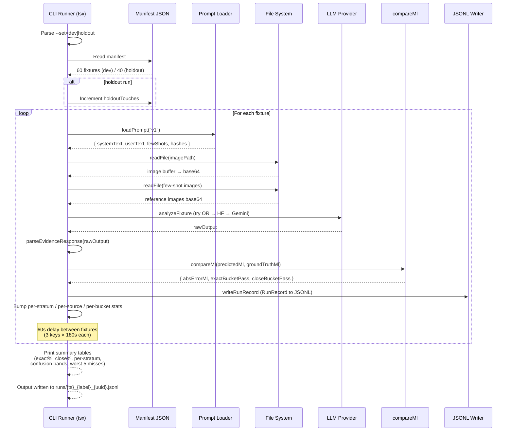

*Caption: Eval runner flow — reads manifest, iterates fixtures with provider orchestration, comparison, and JSONL output. Includes 60s rate limiting between fixtures to avoid exhausting any single API key.*

### CV Pipeline Flow:
```
POST /api/cv-analyze { imageBase64, bottleSizeMl }
    ↓
Validate image format + size
    ↓
runPipeline():
  Stage 1: validateBottle (1500ml only)
  Stage 2: preprocess (decode → grayscale → blur → CLAHE)
  Stage 3: contour detection (Canny → findContours → score → meniscus)
  Stage 4: confidence scoring
    ↓
Response: { remainingMl, category, confidence, tier, diagnostics }
```

---

## 8. Configuration

### 8.1 Root `package.json`

NPM Scripts:
| Script | Description |
|--------|-------------|
| `build` | Build all packages |
| `test` | Test all packages |
| `eval:dev` | Run dev-set eval |
| `eval:holdout` | Run holdout eval |
| `eval:dev-quick` | Quick probe eval |
| `eval:edge` | CV edge-case eval |
| `signoff` | Stage 1 exit gate |

### 8.2 Worker `wrangler.jsonc`

```json
{
  "name": "afia-stage1",
  "main": "src/index.ts",
  "compatibility_date": "2025-09-01",
  "compatibility_flags": ["nodejs_compat"],
  "assets": {
    "directory": "../web/dist",
    "binding": "ASSETS",
    "not_found_handling": "single-page-application"
  },
  "observability": { "enabled": true }
}
```

### 8.3 Web `vite.config.ts`

- React plugin
- `/api` proxy to `localhost:8787` (dev)
- Build output: `web/dist`

### 8.4 `.env` File

Contains API keys (not committed):
- `GEMINI_API_KEY` (4 keys: primary + 2-4)
- `GEMINI_API_KEYS` (comma-separated alternative)
- `GROK_API_KEY`
- `HF_API_KEY`
- `OPENROUTER_API_KEY`
- `SUPABASE_URL`, `SUPABASE_SERVICE_ROLE_KEY`, `SUPABASE_STORAGE_BUCKET`

---

## 9. Image Data

### Real Frames (`oil-bottle-frames/`)
- ~1,148 real images extracted from video frames
- 28 fill levels in 55ml steps: 55ml, 110ml, ..., 1500ml
- ~41 frames per level at different timestamps
- Filename pattern: `{level}ml_t{seconds}s_f{frame}.jpg`
- Reference images: `1.5L_refs/` (1500ml.jpg, 750ml.jpg, 55ml.jpg, empty.jpg)

### Augmented Images (`oil-bottle-augmented/`)
- ~14,924 AI-augmented variants
- 28 fill levels + `empty/` folder
- ~533 frames per level

---

## 10. Testing Strategy

### Worker Tests (20 files)
| Test File | Covers |
|-----------|--------|
| `smoke.test.ts` | Basic imports and constants |
| `analyze-route.test.ts` | POST /api/analyze validation |
| `admin-route.test.ts` | Admin route auth + CRUD |
| `cv-analyze.test.ts` | CV endpoint validation |
| `cv-contour.test.ts` | Contour detection edge cases |
| `cv-confidence.test.ts` | Confidence scoring |
| `cv-geometry.test.ts` | Geometry calibration |
| `cv-errors.test.ts` | Pipeline error generation |
| `gemini.test.ts` | Gemini client (mocked SDK) |
| `grok.test.ts` | Grok client (mocked fetch) |
| `rotation.test.ts` | Key pool rotation |
| `parse-response.test.ts` | Response parsing (fences, clamping, errors) |
| `prompt-load.test.ts` | Prompt loading + deterministic hashes |
| `compare.test.ts` | Comparator (±55ml, ±110ml) |
| `manifest.test.ts` | Manifest sampler (determinism, disjoint) |
| `jsonl.test.ts` | JSONL writer |
| `stage1-flow.test.ts` | End-to-end eval flow |
| `supabase-storage.test.ts` | Storage operations |

### Web Tests (7 files)
- `stage1-client-flow.test.tsx`
- `result-shell.test.tsx`
- `capture-shell.test.tsx`
- `admin-shell.test.tsx`
- `scan-shell.test.tsx`
- `mock-qr.test.tsx`
- `FloatingControls.test.tsx`

### Shared Tests (3 files)
- `types.test.ts`
- `product-link.test.ts`
- `scan-schema.test.ts`

---

## 11. Dependencies

### Worker Dependencies
| Package | Purpose |
|---------|---------|
| `@google/generative-ai` | Google Gemini SDK |
| `hono` | HTTP router framework |
| `zod` | Response validation |
| `@supabase/supabase-js` | Supabase client |
| `@techstark/opencv-js` | OpenCV WASM for CV pipeline |
| `jpeg-js` | JPEG image decoding |
| `pngjs` | PNG image decoding |
| `sharp` | Image processing (template extraction) |
| `dotenv` | Environment variable loading |
| `tsx` | TypeScript execution (CLI runner) |

### Web Dependencies
| Package | Purpose |
|---------|---------|
| `react`, `react-dom` | UI framework |
| `react-router-dom` | Client-side routing |
| `@afia/shared` | Shared types/constants |

### Dev Dependencies
| Package | Purpose |
|---------|---------|
| `vitest` | Test runner |
| `@testing-library/react` | React component testing |
| `@testing-library/jest-dom` | DOM matchers |
| `jsdom` | DOM environment for tests |
| `typescript` | Type checking |
| `tailwindcss` | CSS framework |
| `wrangler` | Cloudflare deployment |

---

## 12. Key Design Decisions

### Why derive ml from Y-ratio instead of trusting LLM percentage?
The initial approach let the LLM predict a `fillPercent`. The remediation plan discovered the LLM was making vague mid-range guesses. The fix: force the model to detect the physical oil-air boundary Y position, then compute ml programmatically from fixed bottle geometry. This makes the measurement constrained by physics, not the model's guess.

### Why no Zod in shared package?
The shared package must work in both worker and web without pulling heavy dependencies. Zod is only used in `worker/src/eval/parse-response.ts`. The shared package uses hand-written validators.

### Why 55ml steps?
55ml equals one quarter-cup (standard cooking measure). This is the fundamental evaluation unit and slider step.

### Why separate eval runner (CLI) from HTTP API?
Stage 1 is a research spike. The eval runner runs as a Node.js CLI against local image files with 60s rate limiting between calls. The HTTP API endpoint (`POST /api/analyze`) handles real-time consumer requests with 1s retry intervals. They share the same LLM client code but have different rate-limiting and error-handling strategies.

### Why reference images stripped for HF Qwen but not OpenRouter?
The HuggingFace Inference API has strict payload limits (1MB-5MB). Sending 7 reference images as base64 inline exceeds this limit (413 Payload Too Large). OpenRouter supports multiple images per turn.

### Why CV pipeline as a separate path?
The CV pipeline provides on-device analysis capability (OpenCV.js WASM). It can serve as a fallback or complement to LLM analysis, especially for images where LLM struggles (glare, dark, extreme fill levels).

---

## Appendix: Visual Diagram Index

| # | Diagram Name | Section | Type | Description |
|---|-------------|---------|------|-------------|
| 1 | System Architecture Overview | §4.5 (after Directory Structure) | `graph TD` | High-level system showing Hono Worker, LLM providers, CV pipeline, Supabase, and SPA |
| 2 | Provider Orchestration (Eval) | §5.4.1 (LLM Layer) | `flowchart TD` | OpenRouter → HF Qwen → Gemini multi-key rotation with retry logic |
| 3 | CV Pipeline Stages | §5.6.2 (pipeline.ts) | `graph LR` | Four sequential stages with early-exit paths for each failure mode |
| 4 | Contour Detection Algorithm | §5.6.4 (contour.ts) | `flowchart TD` | Canny → adaptive fallback → scoring → Sobel horizontal edges → meniscus selection |
| 5 | Fill Ratio Calculation | §5.6.6 (geometry.ts) | `flowchart TD` | Meniscus Y-ratio to fill ratio/remaining ml using fixed bottle geometry |
| 6 | Comparator Decision Tree | §5.7.4 (compare.ts) | `flowchart TD` | ±55ml exact / ±110ml close tolerance checks |
| 7 | Fixture Stratification | §5.7.2 (manifest.ts) | `mindmap` | 4-axis stratification (source, fill, frame, seed) with 60/40 partition |
| 8 | Consumer Flow | §7 (Data Flow) | `sequenceDiagram` | User → QR → camera → API → LLM → Supabase → result display |
| 9 | Eval Framework Fixture Flow | §7 (Data Flow) | `sequenceDiagram` | CLI runner → manifest → per-fixture analysis → comparison → JSONL output |
| 10 | Supabase Storage Operations | §5.8.1 (supabase.ts) | `flowchart TD` | save, update, list, manual upload operations with DB/Storage interactions |
| 11 | Camera State Machine | §6.6.4 (CaptureShell.tsx) | `stateDiagram-v2` | Starting → ready/blocked/missing → analyzing → success/error with retry |
| 12 | ResultShell State Machine | §6.6.5 (ResultShell.tsx) | `stateDiagram-v2` | Loading/error/normal/no_data states driven by sessionStorage |
| 13 | Admin Component Structure | §6.6.6 (AdminShell.tsx) | `graph TD` | Two-tab admin: review queue with correction forms, manual upload |

---

## 18. Current Documentation Update - 2026-05-17

This section records the latest project-context refresh requested through BMad help. It is intentionally additive so historical Stage 1/Stage 2 notes above remain available for traceability.

### 18.1 BMad Workflow Position

The project is in implementation/documentation-maintenance mode. Relevant BMad actions are:

| Menu | Skill | Use |
|------|-------|-----|
| SS | `bmad-sprint-status` | Summarize current implementation state, risks, and next story routing. |
| CK | `bmad-checkpoint-preview` | Human-in-the-loop branch review before merging. |
| DP | `bmad-document-project` | Regenerate broad project documentation after significant code movement. |
| GPC | `bmad-generate-project-context` | Refresh the concise LLM-oriented project context. |

### 18.2 Current Source Inventory

- Root package scripts: `build`, `test`, `eval:dev`, `eval:holdout`, `eval:dev-quick`, `eval:edge`, and `signoff`.
- Worker scripts: `eval:cv`, `gate:rss`, `probe:gemini`, `build-manifest`, and `baseline:capture` in addition to test/build.
- Worker routes: `analyze`, `cv-analyze`, `admin`, and `onnx-probe`.
- Worker subsystems: LLM provider orchestration, prompt loading/hashing, eval runner, CV pipeline, ONNX feasibility/runtime helpers, scoring/fusion, and Supabase storage.
- Web subsystems: scan shell, capture shell, result shell, admin shell, mock QR page, theme/language controls, session state.
- Shared package: bottle constants, product-link helpers, schemas, and TypeScript contracts used by web and Worker.

### 18.3 Accuracy and Evaluation Notes

- The 55ml quarter-cup bucket remains the primary correction/evaluation unit.
- `eval:dev-quick` is a fast 12-fixture Gemini regression guardrail; a deliberate break produced 0/12 exact accuracy and confirmed that the probe exposes systematic failures.
- API-backed Gemini evals must respect rate limits. This branch documents and preserves a 13-second inter-call delay for Gemini eval calls.
- Phase 2 found heuristic-only scoring insufficient for the empty/full confusion target; ONNX regression is the recommended next accuracy path.
- ONNX feasibility passed binary-size, p95 latency, and cold-start thresholds locally. RSS remains conditional until measured in the Worker isolate environment.

### 18.4 Documentation Ownership

- `README.md` is the contributor quick start and current-scope summary.
- `docs/project-context.md` is the compact AI/BMad operating context.
- `docs/COMPREHENSIVE-DOCUMENTATION.md` is the long-form project reference.
- `docs/cv-pipeline-architecture.md`, `docs/phase-02-summary.md`, and `docs/decision-gate-onnx.md` are the current CV/ONNX reference documents.

When these files disagree, prefer the newest dated section and then reconcile the stale section in a follow-up documentation task.
